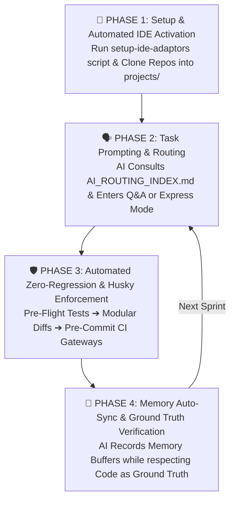

# 🚀 Master Step-by-Step Operational Playbook (`HOW_TO_WORK.md`) v3.0

> **The definitive real-world developer execution guide detailing how software engineers and autonomous AI coding assistants collaborate using the v3.0 AI Developer Brain without rule ignorance or memory drift.**

---

## 🎯 The Real-World Engineering Reality

When deploying AI coding assistants across collaborative team environments, relying purely on plain-text Markdown suggestions leads to rule ignorance, memory drift, and IDE configuration friction. 

Our v3.0 operational playbook combines an **Ultra-Clean Root Architecture** with **Automated Script Symlinking** and **Physical CI / Pre-Commit Enforcement Gateways** to ensure flawless execution across four structured phases:



---

## 🏁 PHASE 1: Workspace Setup & Automated IDE Activation (Day 0)

### Step 1.1: Activate Universal AI IDE Adaptors Without Root Git Clutter
Because AI tools (*Cursor, Windsurf, Cline, Copilot*) are natively hardcoded to look for rules at the repository root, but our team requires an ultra-clean Git root, execute our one-click initialization script. This creates ignored local symlinks/copies directly from `.brain/` to your root IDE path:

```bash
# For Windows / PowerShell Developers:
powershell -ExecutionPolicy Bypass -File ".\.brain\scripts\setup-ide-adaptors.ps1"

# For Linux / macOS / UNIX / CI Pipelines:
bash ./.brain/scripts/setup-ide-adaptors.sh
```
* **Why this works**: Our root `.gitignore` excludes these IDE files from git commits while ensuring Cursor, Windsurf, Cline, and Copilot read their instructions 100% of the time!

### Step 1.2: Adding Your Application Code into `projects/`
Bring ANY programming language or framework into our targeted workspace directories:
```text
AI-Developer-Brain/              <-- Repository Root
├── 🧠 .brain\                   <-- AI intelligence, scripts, token rules & active memory buffers
└── 🚀 projects\                 <-- Where you place your codebase repositories:
    ├── ⚙️ backend\              <-- Node.js, Python, Go, Rust, Java, or .NET APIs
    ├── 🎨 frontend\             <-- React, Next.js, Vue, Svelte, or Angular web apps
    ├── 🛡️ admin\                <-- Backoffice CRM & dual-layer RBAC portals
    └── 📱 mobile\               <-- Flutter, React Native, iOS, or Android apps
```

---

## 🗣️ PHASE 2: Task Prompting & Execution Modes

Whenever you assign a task to an AI assistant, it consults **[AI_ROUTING_INDEX.md](./AI_ROUTING_INDEX.md)** to load ONLY the exact domain micro-handbook needed (saving up to 70% tokens) and enters one of three execution modes:
1. **Mode A: 🗣️ Interactive Q&A Planning ("Grill-Me" Protocol)**: The AI pauses before editing code to interview the developer with multiple-choice trade-off options (*recommending optimal choices first*).
2. **Mode B: ⚡ Express Fast-Track Override**: If requirements specify rapid building (*e.g., "auto-decide standard trade-offs and build fast"*), the AI bypasses Q&A interviews and executes production code immediately.
3. **Mode C: 🌱 Greenfield Exemption**: On empty repositories where zero code exists yet, the AI bypasses pre-flight test blocks and scaffolds automated unit test runners alongside initial code generation.

---

## 🛡️ PHASE 3: Automated Zero-Regression & CI Pre-Commit Gateways

Plain text Markdown rules are guidance; automatedContinuous Integration (CI) tools are enforcement. To prevent AI models from silently guessing code or ignoring standards under heavy prompting, engineering teams MUST configure automated gateways:

### Step 3.1: Configure Git Pre-Commit Hooks (Husky & Lint-Staged)
Inside your target project (*e.g., `projects/frontend`*), set up automated pre-commit triggers that physically reject non-compliant AI commits:
```bash
# Install Husky & Lint-Staged in Node/TS projects:
npm install -D husky lint-staged
npx husky init

# Configure .husky/pre-commit check:
echo "npx tsc --noEmit && npx lint-staged && npm test -- --watchAll=false" > .husky/pre-commit
```
* **Real-World Safeguard**: Even if an AI ignores a rule in chat, Git physically blocks the commit if static type checking or unit tests break!

### Step 3.2: Self-Healing TDD Bug Hunting
When pre-flight tests or linters fail after an AI edit, the agent invokes our diagnostic loop: stop feature work -> write reproducing unit test -> inspect AST line stack without guessing -> apply surgical drop-in fix!

---

## 🔄 PHASE 4: Memory Auto-Sync vs. The Law of Ground Truth

To keep context lightweight while preventing "stale memory" bugs across multi-member sprint teams:
1. **Perpetual Auto-Update Loop**: At the end of every task, AI assistants autonomously record schema additions, new routes, and Architecture Decision Records (ADRs) directly into **`.brain/memory/`**.
2. **🚨 The Law of Ground Truth**: Memory buffers are a rapid caching hint. **ACTIVE COMPILED SOURCE CODE AND RUNNING TESTS ARE ALWAYS THE ULTIMATE GROUND TRUTH**. If a human engineer directly modified code without invoking AI, causing a discrepancy in `backend-memory.md`, future AI assistants are mandated to trust the active code and self-heal the outdated memory file immediately!

---

## 💻 PHASE 5: Production Command Vault

### 1. ⚡ Verification & Regression Runners
```bash
# Node / TypeScript Static Perimeter Type Check:
npx tsc --noEmit && npm test -- --watchAll=false

# Python Pytest Fail-Fast Verification:
pytest --maxfail=1 -v --disable-warnings

# Go / Rust Multi-Module Verification Suite:
go test -v -race ./... && cargo test --all

# Flutter Mobile Analysis & Unit Test Suite:
flutter analyze && flutter test
```

### 2. 🛡️ Continuous Governance & Diff-Reflector Utilities
```bash
# Execute automated Continuous Governance Audit (Zero-Trust secrets, root clutter, link health):
powershell -ExecutionPolicy Bypass -File ".\.brain\scripts\validate-brain-governance.ps1"

# Execute automated Diff-to-Memory Reflector to synchronize Git commit deltas into memory:
powershell -ExecutionPolicy Bypass -File ".\.brain\scripts\diff-to-memory-reflector.ps1"
```

### 3. 📝 Ready-to-Use AI Prompting Payloads
Copy and paste these structural contracts directly into Cursor, Windsurf, or Antigravity:

#### 🟢 Payload A: Interactive Feature Design ("Grill-Me" Loop)
```markdown
### 🎯 Task Type: Interactive Architecture & Implementation Plan
- **Target Project**: `projects/backend` (Payment Routing Gateway)
- **Context Directive**: Read `.brain/AI_ROUTING_INDEX.md` and load only `backend-memory.md` and `backend-and-cloud.md`.
- **Requirements**: Implement webhook event handlers for Stripe billing integration with Postgres table upserts.
- **Execution Mode**: Pause before coding! Initiate our **Interactive Q&A (Grill-Me) loop** to present trade-offs regarding idempotency key storage and retry queues (recommending optimal engineering choices first).
```

#### ⚡ Payload B: Express Fast-Track Production Build
```markdown
### ⚡ Task Type: Express Fast-Track Implementation
- **Target Project**: `projects/frontend` (Dashboard KPI Analytics)
- **Specifications**: Implement a glassmorphic KPI statistics card in `src/components/dashboard/` using HSL design tokens.
- **Execution Directive**: **AUTO-DECIDE STANDARD TRADE-OFFS & BUILD FAST.** Bypass Q&A interview pauses, adhere to v3.0 modular diff rules, verify local tests post-edit, and autonomously synchronize memory records.
```

---

## 🎉 Ready for Unprecedented AI Collaboration & Engineering Scale!
By pairing `.brain/` with physical Git automation and symlinked adaptors, your real-world team operates with maximum speed, zero hallucination, and rock-solid architectural control!
