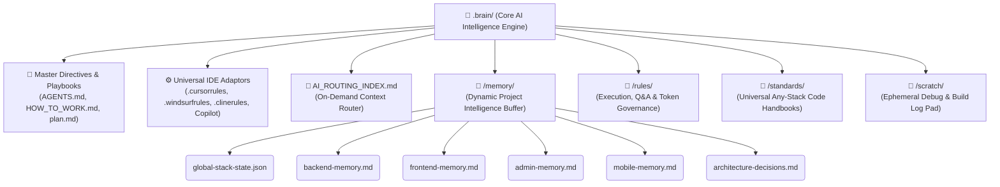

# 🧠 v3.0 Core AI Intelligence Engine (`.brain/`)

> **The unified, world-class artificial intelligence command center powering autonomous software engineering across ALL application project workspaces (`projects/backend`, `frontend`, `admin`, `mobile`).**

---

## 🌟 Why `.brain/` is World-Class & Universal (Any-Stack)

To maintain an **ultra-clean zero-clutter workspace root**, ALL AI intelligence, rules, playbooks, and IDE adaptors are consolidated into this dedicated `.brain/` command chamber.

The **v3.0 `.brain/` Core Engine** empowers developer teams and AI assistants through three breakthrough pillars:
1. **Zero Root Clutter**: Everything needed by your AI assistants (*Cursor, Windsurf, Claude, Gemini, Cline*) resides right here, keeping your repository root clean and focused exclusively on active code projects.
2. **Token-Minimal On-Demand Context Loading**: Leveraging **[AI_ROUTING_INDEX.md](./AI_ROUTING_INDEX.md)**, AI assistants read *only* the specific domain micro-handbook required for the immediate task, reducing prompt token costs by up to **70%**.
3. **Perpetual Self-Updating Memory Loop**: Through the dedicated **[memory/](./memory/)** directory, the AI continuously records new schemas, APIs, stack states, and architectural decisions automatically after every engineering task!

---

## 📂 Internal Architecture of `.brain/`

### 1️⃣ 📜 Directives, Playbooks & Adaptors
* **[`AGENTS.md`](./AGENTS.md)**: Master global directives for zero-regression, any-stack development.
* **[`HOW_TO_WORK.md`](./HOW_TO_WORK.md)**: Step-by-step developer playbook & CLI command vault.
* **[`plan.md`](./plan.md)**: Master architectural evolutionary roadmap.
* **IDE Adaptors**: Pre-configured bridge files (`.cursorrules`, `.windsurfrules`, `.clinerules`, `github-copilot-instructions.md`) ready to guide your AI editors!

### 2️⃣ 📁 `/memory/` (The Auto-Updating Cortex)
Stores condensed, token-lightweight state files representing your active codebase. When developers clone any project stack into `projects/`, the AI reads and updates these buffers instead of scanning thousands of source files!

### 3️⃣ 📁 `/rules/` (Operational Guardrails)
Contains structured state machines for AI behavior:
* **Token Optimization & Context Hygiene**: Surgical code discovery without token waste.
* **Agentic Orchestration & TDD Bug Healing**: Subagent swarm delegation and automated bug-reproduction loops.
* **Interactive Q&A & Zero-Regression Shields**: Mandatory pre-flight test verification and developer interviews.

### 4️⃣ 📁 `/standards/` (Production Domain Handbooks)
High-density code guidelines comparing **✅ Good (Production Standard)** vs. **❌ Bad (Anti-Pattern)** implementations across backend APIs, modern styling systems, offline mobile sync, cyber security, and automated testing!

---

## ⚡ How to Integrate with Your Project Code
Simply place your application source code into the corresponding workspace inside **`../projects/`**. Whether you are coding in Python, Go, TypeScript, Rust, Flutter, React, or Java, your AI assistant will reference this `.brain/` hub to deliver world-class engineering precision!
