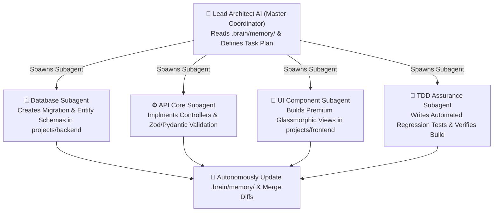
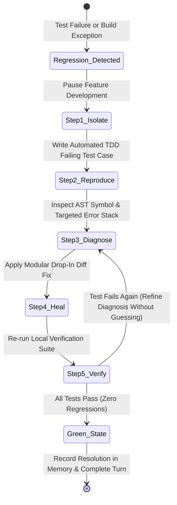

# 🤖 Smart Agentic Orchestration & Self-Healing TDD Loops

> **The advanced execution protocol enabling autonomous AI assistants to manage long-running, multi-layered development projects cleanly in one shot without human intervention or token exhaustion.**

---

## 🐝 Section 1: Multi-Agent Task Decomposition & Subagent Swarms
When tackling complex full-stack features involving simultaneous modifications across databases, APIs, interactive UIs, and automated tests, trying to execute everything in a single linear context causes token saturation and logic confusion.

### 1.1 The Lead Architect & Subagent Swarm Pattern
The master AI assistant acts as the **Lead Domain Architect**. Instead of executing massive multi-workspace edits directly, it decomposes work into isolated sub-tasks and delegates execution to focused subagents (*or modular context turns*):

### 1.2 Subagent Isolation Directives
1. **Scoped Instructions**: Each subagent receives only the specific workspace target (*e.g., `projects/frontend`*) and the exact required micro-handbook from `.brain/standards/`.
2. **No Cross-Talk Hallucination**: A UI subagent must never alter database migration scripts; a backend subagent must never modify client styling tokens.
3. **Aggregated Memory Merge**: As each subagent finishes its task, the Lead Architect records the unified structural changes into **`.brain/memory/`**.

---

## 🩺 Section 2: The Self-Healing TDD Bug Hunting State Machine
When an automated unit test fails, a compiler throws syntax exceptions, or an application runtime encounters a regression, the AI assistant MUST switch immediately from feature creation into the **Self-Healing TDD Bug Hunting State Machine**:

### 2.1 The 5-Step Self-Healing Protocol
1. **Stop & Isolate**: Immediately halt adding new feature logic. Do not compound broken code with speculative feature edits.
2. **Test-Driven Reproduction (TDD First)**: Before attempting to fix the bug, write a concise automated unit or integration test case that explicitly exposes the failure (*e.g., passing invalid payload to trigger the crash*). Prove that the reproduction test fails cleanly.
3. **Surgical Root-Cause Diagnosis (No Blind Guessing!)**:
   * Inspect exact stack trace line numbers using `grep_search` or targeted file viewing.
   * Verify variables against strict types. **NEVER try arbitrary fixes or comment out broken tests to force a green light!**
4. **Modular Drop-In Healing**: Apply a targeted drop-in diff to repair the logic flaw without breaking adjacent functions.
5. **Verification & Auto-Documentation**: Run automated test suites to confirm both the reproduction test and historical regression suites pass cleanly. Once confirmed green, document any unexpected gotchas or boundary rules in **`.brain/memory/`**!
