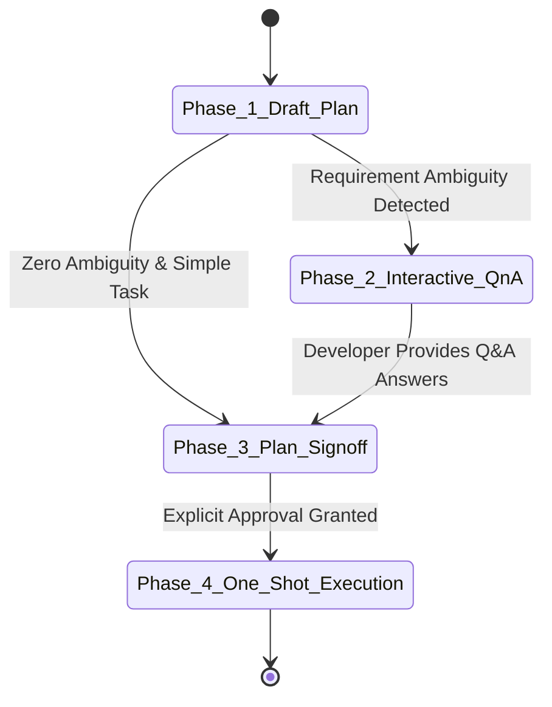

# 🗣️ Interactive Q&A & Dynamic Planning Protocol (The "Grill-Me" Engine)

> **An operational state machine that prevents autonomous AI assistants from making flawed architectural assumptions by enforcing interactive requirement gathering prior to coding.**

---

## 🎯 Purpose & Scope (Any-Stack Compatible)
When tasked with a complex feature request across `projects/backend`, `frontend`, `admin`, or `mobile`, an AI coding assistant left without verification will often hallucinate requirements or implement generalized design patterns that conflict with the human developer's vision. 
This protocol mandates that agents **draft a preliminary plan, interview the developer via structured Q&A options, update their implementation plan according to the answers, and await explicit approval before generating source code**.

---

## 🔄 The 4-Stage Operational State Machine

### Phase 1: Deep Research & Preliminary Plan Draft
When receiving a feature request or architectural upgrade task:
1. **Analyze Local Context**: Check **[global-stack-state.json](../memory/global-stack-state.json)** and relevant domain memory inside **`../memory/`** to understand the active stack.
2. **Draft Technical Plan**: Outline proposed changes, target component boundaries, and required dependencies.
3. **Identify Ambiguity Points**: Scan for unspecific UX styling instructions, ambiguous database schema models, or conflicting third-party integrations.

### Phase 2: The Interactive Q&A Interview (Grill-Me Protocol)
If any significant design decisions or underspecified requirements emerge during Phase 1, the AI agent MUST **pause execution and engage the developer in a structured Q&A dialog**:
1. **Multiple-Choice Formatting**: Present questions with distinct selectable options (formatted as the user's direct response) along with concise engineering trade-off evaluations.
2. **Recommendation First**: List your professional recommendation as option #1, prefixed with `(Recommended)`.
3. **Example Interactive Prompt**:
   > *"Before implementing the admin audit log storage, please clarify our persistence strategy:*  
   > - *A) **(Recommended) Store logs directly in PostgreSQL** using an immutable partitioned table (Best for ACID compliance and transactional relational querying).*  
   > - *B) **Stream logs to AWS CloudWatch / ElasticSearch** via async Redis worker events (Best for isolating logging storage from primary transactional compute).*  
   > - *C) **Write logs to rotating local disk JSONL files** (Lightweight MVP approach without external cloud costs)."*
4. **Fast-Track Override**: If the developer provides an exhaustive requirement stack, explicitly requests immediate execution (*e.g., "build fast", "auto-decide trade-offs"*), or if trade-offs involve straightforward production defaults, **skip interactive Q&A**, execute the recommended architecture immediately, and clearly document your trade-off selections in the walkthrough report.

### Phase 3: Dynamic Plan Update & Sign-Off
Once the developer selects their preferred options:
1. **Update Plan**: Immediately modify your implementation plan to reflect the user's explicit choices, closing out open questions.
2. **Obtain Approval**: Ask the developer for explicit confirmation (*e.g., "Plan aligned with your Q&A selections. Do you approve proceeding to one-shot execution?"*).

### Phase 4: Transition to One-Shot Execution
Upon receiving explicit developer authorization:
1. Invoke the **[Zero-Regression Execution Protocol](./zero-regression-execution.md)** to implement all requested functionality cleanly in one automated coding turn without breaking existing software features!
2. Autonomously record major decisions into **[architecture-decisions.md](../memory/architecture-decisions.md)**!
