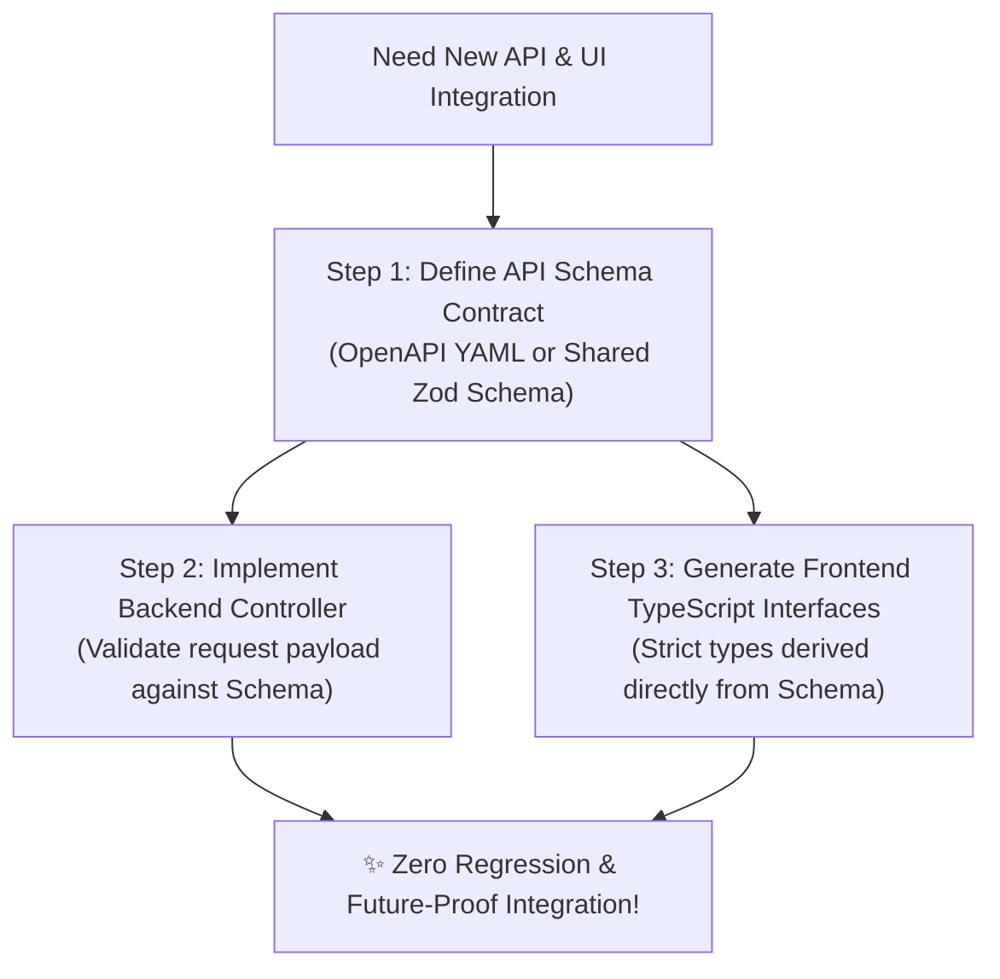

# 🌐 Schema-First Interface Agreement & Protocol Rules

> **The definitive rules governing language-agnostic API contract protocols between backend servers and frontend/mobile client applications.**  
> **🚨 PRIMARY DIRECTIVE**: Syntax changes over the years, but formal Schema Interfaces guarantee lasting compatibility across teams, frameworks, and AI models. AI coding assistants MUST NEVER invent ad-hoc API payload structures or unvalidated client fetching hooks. All data boundaries MUST adhere to formalized schema agreements.

---

## 1. Protocol Over Syntax (Why We Do Not Hardcode Frameworks)
In polyglot enterprise repositories where `projects/backend` may evolve from Node.js to Python FastAPI or Rust, and `projects/frontend` may evolve from React to Vue or Web Components, client-server communication must be governed by declarative schema files:
* **OpenAPI 3.1 / Swagger**: For standard REST API endpoints and HTTP response codes.
* **JSON Schema / Zod / Pydantic**: For runtime payload type serialization and boundary validation.
* **Protobuf / gRPC / GraphQL SDL**: For high-performance internal microservices or mobile data synchronization.

---

## 2. Mandatory Schema-First Workflow
When a developer commands an AI assistant to create a brand-new full-stack feature (*e.g., User Authentication or Billing Analytics*):



1. **Step 1: Establish Contract First**: Draft or update the interface contract in `.brain/standards/contracts/` or shared project types BEFORE writing UI fetch code or backend database logic.
2. **Step 2: Backend Compliance**: Backend endpoint handlers in `projects/backend` must import the schema validator (*Zod in TypeScript, Pydantic in Python, Valibot*) to validate incoming Request Bodies and parameter parameters at runtime.
3. **Step 3: Frontend Client Synthesis**: Frontend React/Vue hooks in `projects/frontend` or Flutter clients in `projects/mobile` MUST consume strongly typed interfaces derived directly from the schema agreement! Never write explicit raw `fetch('url')` calls with `any` types.

---

## 3. Standard API Error & Success Schema Response Contract
All HTTP REST APIs constructed in this workspace must adhere to a single unified JSON response structure to prevent client-side parsing failures:

```json
{
  "success": true,
  "statusCode": 200,
  "data": {
    "id": "usr_98a7sd",
    "status": "ACTIVE",
    "timestamp": "2026-08-02T10:00:00Z"
  },
  "error": null
}
```

### In case of failure:
```json
{
  "success": false,
  "statusCode": 422,
  "data": null,
  "error": {
    "code": "VALIDATION_ERROR",
    "message": "Email field is required and must be valid format.",
    "fieldErrors": {
      "email": ["Invalid email format"]
    }
  }
}
```
* **Why this rules the industry**: Whether an offline local Llama model or Claude Opus generates frontend UI components, a consistent JSON error interface ensures automated error handling, toast notifications, and form validation across every language without human intervention!
