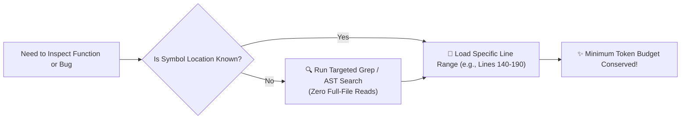

# ⚡ Token Optimization, Context Hygiene & Surgical Discovery Rules

> **The definitive operational instruction set governing how autonomous AI coding assistants achieve world-class software development while consuming the absolute minimum token footprint.**  
> **🚨 PRIMARY DIRECTIVE**: Token bloat slows down inference latency, increases cloud compute costs, and degrades LLM attention ("lost-in-the-middle" hallucination). AI agents operating in this workspace MUST follow these explicit token-conserving protocols.

---

## 🔬 Section 1: Surgical Code Discovery over Monolith Dump
When exploring source code to implement features or trace bugs, autonomous agents are strictly forbidden from dumping full file contents into their context window when targeted searching suffices:

### 1.1 Mandatory Search & Lookup Ordering (Memory Cache vs. Ground Truth)
1. **Index-First Navigation & Ground Truth Rule**: Always consult **[AI_ROUTING_INDEX.md](../AI_ROUTING_INDEX.md)** and active memory (**`../memory/*`**) first to gain rapid context without token bloat. However, remember that **active code is the sole Ground Truth**. If a memory summary contradicts compiled codebase files in `projects/`, rely on the codebase and auto-update the memory buffer immediately!
2. **Pattern-Matching with Ripgrep / Ast-Grep**: Use localized pattern searches (*e.g., `grep_search`*) to identify exact symbol declarations, interface definitions, or error codes rather than scanning directories manually.
3. **Targeted Line-Range Reading**: Once the target symbol is found, load ONLY the required 50–150 line slice around the function or class using line-range parameters (*e.g., `view_file` with `StartLine` and `EndLine`*). **Never read a 2,000-line source file just to inspect a single 20-line utility helper!**

---

## ✂️ Section 2: Non-Destructive Modular Diff Protocol
When proposing or applying modifications to source code files:
1. **Surgical Drop-In Diffs**: ALWAYS apply targeted code chunk replacements (*e.g., `replace_file_content` / `multi_replace_file_content`*). Specify the exact lines to modify without rewriting unchanged functions above or below the diff block.
2. **Prohibition of Whole-File Overwrites**: Never replace an existing 500-line application controller just to alter two variables in a single method. Whole-file rewriting multiplies output tokens by 20x and dramatically increases regression risk.
3. **Preserve Surrounding Documentation**: Do not remove existing docstrings, TypeScript interfaces, or error wrapping structures outside the targeted modification zone.

---

## 🧹 Section 3: Context Hygiene & Ephemeral Scratchpad Management
During multi-step debugging sessions or extensive compilation cycles, AI context windows accumulate raw output logs, stack traces, and intermediate diagnostic prints.

### 3.1 The Ephemeral Scratchpad Rules
* **Temporary Log Storage**: Divert lengthy terminal compiler outputs, schema migration drafts, or verbose API payloads into **`../scratch/`** (*e.g., `../scratch/build-trace.log`*). Do not flood the active chat transcript with 5,000 lines of console output.
* **Autonomous Memory Flushing (Clean-Up Command)**: Upon achieving a green passing test state and finalizing a task:
  1. Distill essential architectural lessons or schema changes into permanent structured memory (**`../memory/`**).
  2. Autonomously delete temporary scratch logs to reset token overhead for the next development loop!

---

## 🏆 Token Efficiency Benchmarks (v3.0 Target)
* **Prompt Load reduction**: ~70% reduction by loading single micro-handbooks instead of global monoliths.
* **Output Token reduction**: ~85% reduction during file refactoring by utilizing modular drop-in diffing.
