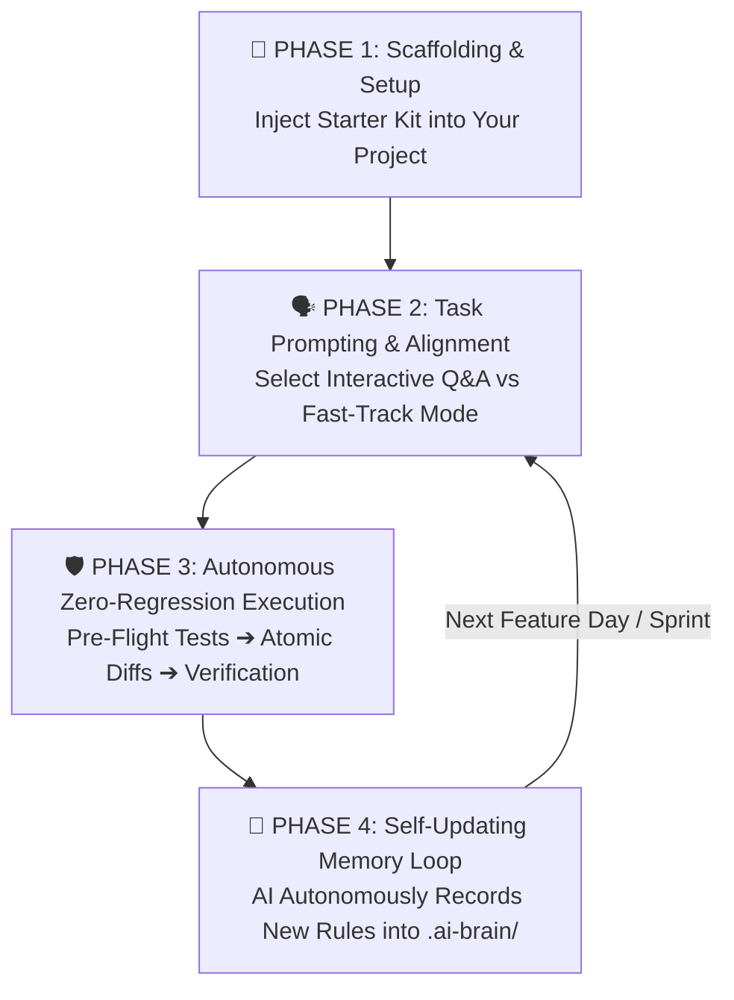
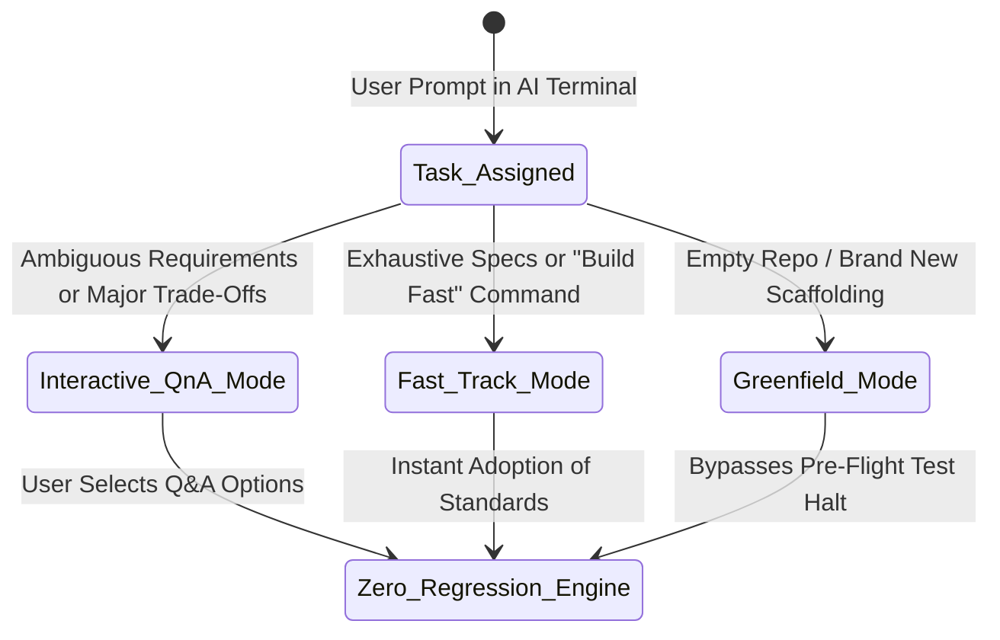
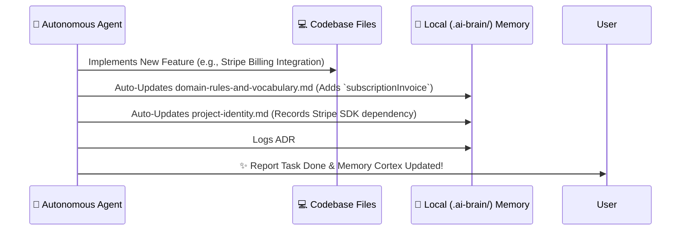

# 🚀 Master Step-by-Step Execution Playbook (`HOW_TO_WORK.md`) v2.1

> **The practical, step-by-step operational instruction handbook detailing exactly how developers and autonomous AI coding assistants collaborate using the AI Developer Brain v2.1.**

---

## 🎯 The Big Picture: How This Ecosystem Operates

The **AI Developer Brain v2.1** functions as a **Smart Autonomous State Machine** that connects your human engineering intent directly into AI coding tools (*Cursor, Windsurf, Claude, Gemini, Antigravity*). 

Instead of writing endless repetition in prompts or watching AI assistants break existing working features, you instantiate an individualized **Local AI Brain (`.ai-brain/`)** inside your app repository. From there, the system follows a clear 4-Phase operational lifecycle:



---

## 🏁 PHASE 1: Project Scaffolding & Setup (Day 0)

### Step 1.1: Organize Your Hard Drive / Server Workspace
To prevent context clutter and enable AI assistants to discover architectural handbooks easily, arrange your storage disk according to our **Numbered Categorical Hub** architecture ([standards/workspace-hub-organization.md](./standards/workspace-hub-organization.md)):

```text
D:\Dev-Workspace\
├── 🧠 00-ai-brain\                 <-- Central AI Hub (Store THIS repository here!)
│   └── AI-Developer-Brain/         <-- Master global AGENTS.md & domain handbooks
│
├── 🚀 01-active-projects\          <-- Live production SaaS & client repositories
│   ├── my-saas-crm\                <-- Your target application repository
│   └── mobile-flutter-app\
│
└── 🛠️ 02-experiments-and-poc\       <-- Prototypes, AI benchmarks & R&D scripts
```

### Step 1.2: 60-Second Local Brain Injection
When initializing a brand-new app or adopting an existing legacy project, navigate to your target project folder and copy the v2.1 starter kit from the central hub:

```bash
# Navigate to your target active application root:
cd /path/to/Dev-Workspace/01-active-projects/my-saas-crm/

# Copy the ready-to-use Local Brain and Root AI Directive:
cp -r ../../00-ai-brain/AI-Developer-Brain/starter-kit/.ai-brain .
cp ../../00-ai-brain/AI-Developer-Brain/starter-kit/AGENTS.md .
```

### Step 1.3: Configure Local Application Identity
Open the newly copied `.ai-brain/project-identity.md` and `.ai-brain/domain-rules-and-vocabulary.md` files inside your app repository and fill out the bracketed placeholders:
* Define your **Approved Tech Stack** (*e.g., Next.js 14, NestJS, Tailwind CSS, PostgreSQL, Zod*).
* Define your **Ubiquitous Domain Vocabulary** (*e.g., mapping corporate clients to `accountTenant` so the AI never hallucinates incorrect database column names*).

---

## 🗣️ PHASE 2: Task Prompting & Execution Modes

Whenever you assign a task to your AI assistant, the system automatically routes execution through one of three smart execution workflows based on your prompt instructions:



### Mode A: 🗣️ Interactive Q&A Planning ("Grill-Me" Mode)
* **When to use**: You want to explore architectural trade-offs, database schemas, or UX designs collaboratively before committing code changes.
* **What happens**: The AI pauses before coding, evaluates alternatives, and displays concise multiple-choice options with explicit pros/cons (*recommending the optimal engineering choice first*).
* **Example User Prompt**:  
  > *"We need to add user authentication and permission tiers to our dashboard. Propose an implementation plan and ask me any necessary clarifying design trade-offs."*

### Mode B: ⚡ Fast-Track Execution Override (Express Mode)
* **When to use**: You already know exactly what you want, specifications are clear, or you want quick automated feature implementation without Q&A pauses!
* **What happens**: The AI bypasses interview dialogs, immediately adopts recommended enterprise patterns (*v2.1 Standards*), and executes code directly.
* **Example User Prompt**:  
  > *"Add a server-side paginated customer transaction grid with Zod validation and Tailwind styling. **Build fast and auto-decide standard utility trade-offs without asking questions.**"*

### Mode C: 🌱 Greenfield & Scaffolding Mode
* **When to use**: You are setting up an empty repository from scratch where zero tests or source files exist yet.
* **What happens**: Thanks to the v2.1 **Greenfield Exemption**, the AI recognizes that tests cannot run on an empty workspace, bypasses Pre-Flight test roadblocks, and autonomously configures automated test runners alongside generating initial source code!

---

## 🛡️ PHASE 3: How AI Executes Code Behind the Scenes (Zero-Regression Engine)

Once execution begins, the AI Assistant rigidly adheres to the **One-Shot Zero-Regression Shield** ([rules-and-workflows/zero-regression-execution.md](./rules-and-workflows/zero-regression-execution.md)) to guarantee that zero existing working functionality ever breaks:

1. **Layer 1: Pre-Flight Baseline Verification**:  
   The AI runs local unit test suites (`npm test`, `pytest`, `npx tsc --noEmit`) to verify the codebase is in a clean green state prior to making amendments. *(Bypassed only during Greenfield initial setups).*
2. **Layer 2: Non-Destructive Atomic Diffing**:  
   The AI applies targeted modular drop-in edits. It will **never** overwrite an entire multi-hundred line file or delete adjacent helper functions when adjusting a single method. Existing comments and error handlers are fully preserved.
3. **Layer 3: Post-Edit Automated Verification Loop**:  
   Immediately after writing code, the AI re-runs the entire unit test and lint verification suite. If its edits trigger a regression failure, the AI auto-reverts or patches the broken diff immediately before reporting task completion to you!

---

## 🔄 PHASE 4: The Self-Updating Memory Loop (Autonomous Learning)

A breakthrough feature of **v2.1** is that your project's intelligent localized memory never becomes stagnant or outdated:



Whenever an AI assistant completes a significant feature turn, it is under a strict **Self-Updating Memory Mandate** to automatically record:
* Newly introduced domain nouns into `.ai-brain/domain-rules-and-vocabulary.md`.
* Approved utility toolkits into `.ai-brain/project-identity.md`.
* Major engineering pivots into `.ai-brain/architecture-decisions.md` (as numbered Architecture Decision Records).

When a different team member or another AI subagent opens the project weeks later, they inherit an up-to-date, self-evolved project memory!

---

## 💻 PHASE 5: Production Command Vault & Example Payloads

To operate effectively across CLI environments and AI chat dialogs, reference this authoritative command and payload vault:

### 1. ⚡ Greenfield Scaffolding Terminal Commands (One-Shot Initialization)
When launching new applications in Phase 1, invoke these exact non-interactive setup scripts:

```bash
# Next.js 14 Enterprise Web App (App Router, Tailwind CSS, TypeScript 5, ESLint, Abs Imports):
npx -y create-next-app@latest ./ --typescript --tailwind --eslint --app --src-dir --import-alias "@/*" --use-npm --no-interactive

# Vite Modern Single-Page App (React + TypeScript):
npx -y create-vite@latest ./ --template react-ts

# NestJS Enterprise Modular API Engine:
npx -y @nestjs/cli new saas-backend-api --package-manager npm --strict

# Python / FastAPI / SQLAlchemy / Alembic Virtual Environment Scaffolding (UNIX/Windows Git Bash):
python -m venv venv && source venv/bin/activate && pip install fastapi uvicorn pydantic sqlalchemy alembic pytest
```

---

### 2. 🧪 Automated Zero-Regression Terminal Commands
For Layer 1 Pre-Flight Baseline checks and Layer 3 Post-Edit Verification, run these explicit commands:

```bash
# Static TypeScript Perimeter Type Check (Zero runtime artifacts):
npx tsc --noEmit

# Vitest Rapid Unit Verification (Disables watch modes for CI/AI execution):
npx vitest run --coverage.enabled=false

# Jest Deterministic Suite Run (Maximized CPU worker performance):
npm test -- --watchAll=false --maxWorkers=50%

# Python Pytest Fail-Fast Regression Check:
pytest --maxfail=1 -v --disable-warnings

# Non-Destructive Auto-Fix Linter & Formatting Check:
npm run lint -- --fix --max-warnings=0

# Typed Database Schema Push Without Running Seeds (Prisma & Drizzle):
npx prisma db push --skip-generate
npx drizzle-kit push
```

---

### 3. 📝 Ready-to-Use AI Task Prompting Payloads
Copy and paste these structured markdown prompt contracts into your AI IDE (*Cursor, Windsurf, Claude, Gemini*) to invoke specific v2.1 behavioral workflows:

#### 🟢 Payload A: Interactive Feature Design ("Grill-Me" Protocol)
```markdown
### 🎯 Task Type: Feature Implementation Plan
- **Feature Title**: Tenant Subscription Dashboard & Export Pipeline
- **Context**: Read our `.ai-brain/` directives and inspect `src/features/billing/`.
- **Requirements**:
  1. Build a responsive transaction data table with CSV download capabilities.
  2. Enforce strict static typing and Zod validation for custom date ranges.
- **Execution Mode**: Pause before modifying code! Initiate our **Interactive Q&A (Grill-Me) loop** to present trade-offs regarding state pagination and CSV parsing libraries (recommending the optimal choice first).
```

#### ⚡ Payload B: Fast-Track Production Build (Express Override)
```markdown
### ⚡ Task Type: Fast-Track Implementation
- **Feature Title**: JWT Blacklist Redis Caching Middleware
- **Specifications**: Implement token revocation validation in `src/middleware/auth.ts` utilizing Redis set lookups with TTLs matching JWT expiration tokens.
- **Execution Directive**: **AUTO-DECIDE STANDARD TRADE-OFFS & BUILD FAST.** Bypass Q&A interview pauses, adhere strictly to v2.1 Zero-Regression rules, verify local tests post-edit, and document design decisions in your final walkthrough report.
```

#### 🛡️ Payload C: Defect Fix & Zero-Regression Patrol
```markdown
### 🛡️ Task Type: Atomic Defect Fix
- **Target Symptom**: `OrderTotal` calculation returns `NaN` when optional promo code payload is `undefined` in the checkout service.
- **Execution Directive**: 
  1. Execute Pre-Flight verification (`npm test`) to reproduce failing test case.
  2. Apply a minimal, non-destructive drop-in atomic diff in `src/services/checkout.ts` without rewriting adjacent functions or removing comments.
  3. Re-run verification suite to guarantee zero regressions before submitting completion.
```

---

### 4. 📦 Structured API & JSON Error Contract Payloads
To enforce our immutable **Zero Silent Failures** rule ([AGENTS.md](./AGENTS.md)), all API endpoints, backend controllers, and error boundaries MUST transmit these deterministic JSON payload contracts:

#### ✅ Successful API Payload Contract (Typed Pagination Representation)
```json
{
  "status": 200,
  "success": true,
  "timestamp": "2026-08-01T20:35:00.000Z",
  "data": {
    "items": [
      { "id": "tenant_001", "name": "Apex CRM", "status": "ACTIVE", "tier": "ENTERPRISE", "mrr": 1450.00 },
      { "id": "tenant_002", "name": "Veloce Labs", "status": "TRIAL", "tier": "STARTUP", "mrr": 299.00 }
    ],
    "meta": {
      "currentPage": 1,
      "pageSize": 25,
      "totalRecords": 142,
      "hasNextPage": true
    }
  }
}
```

#### ❌ Deterministic Error Contract (Zod Perimeter Validation Rejection)
```json
{
  "status": 400,
  "success": false,
  "error": {
    "code": "PERIMETER_VALIDATION_FAILED",
    "message": "Payload schema validation failed at perimeter gateway.",
    "details": [
      { "field": "contactEmail", "issue": "Invalid email formatting structure." },
      { "field": "subscriptionCycle", "issue": "Expected one of ['MONTHLY', 'ANNUAL'], received 'WEEKLY'." }
    ],
    "traceId": "req_gw_99837ab821d"
  }
}
```

---

## 🛠️ Tool-Specific Quick Start Reference

To launch your AI assistant inside any target app equipped with this v2.1 Brain, follow these tool integration norms:

| AI Coding Platform | Setup & Activation Method | Key Behavioral Capabilities |
| :--- | :--- | :--- |
| **Antigravity / Gemini IDE** | Open folder directly. Automatically discovers root `AGENTS.md` and `.ai-brain/`. | Full autonomous state machine, interactive Q&A modal dialogs, and subagent video recordings. |
| **Cursor AI** | Copy or symlink `AGENTS.md` to `.cursorrules` in repository root. | High-precision auto-completion, TDD verification test generation, and atomic multi-file patching. |
| **Windsurf (Codeium)** | Reference `AGENTS.md` inside workspace `.windsurfrules`. | Cascade agent multi-file refactoring without breaking adjacent module interfaces. |
| **Claude Code (CLI)** | Execute inside root; Claude CLI natively reads `AGENTS.md` & local markdown brains. | Deep structural architectural analysis, prompt reasoning, and high-density documentation synthesis. |
| **GitHub Copilot** | Copy global core guidelines into `.github/copilot-instructions.md`. | Consistent symbol autocompletion matching established local domain vocabulary and formatting. |

---

## 🎉 Ready for Enterprise One-Shot Execution!
You are now ready to operate high-scale software development with zero AI hallucination, zero functional regression, and an autonomous memory engine! Explore our domain handbooks inside **[📚 /standards/](./standards/README.md)** for detailed TypeScript, Python, and SQL production code snippets.
