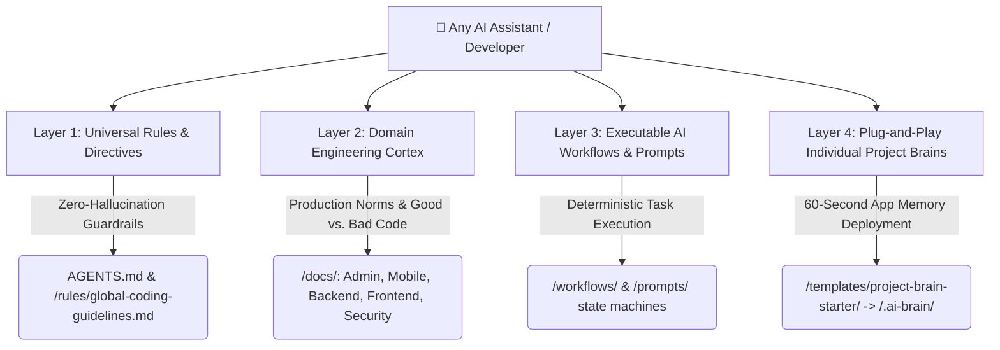

# 🧠 AI Developer Brain

> **A Universal, Tool-Agnostic AI Engineering Knowledge Base & Plug-and-Play "Individual Project Brain" Starter Ecosystem for Building High-Scale Production Software.**

[](https://opensource.org/licenses/MIT)
[](CONTRIBUTING.md)
[](#-the-4-layer-high-density-architecture)
[](#-universal-ai-tool-compatibility-matrix)

---

## 🎯 Purpose & Core Philosophy

Modern software engineering involves tight collaboration between human developers and AI coding assistants. However, traditional documentation and legacy codebases fail when paired with AI assistants because they are verbose, unstructured, and tied to single IDE platforms or outdated paradigms—leading to LLM hallucination, security bugs, and architectural regression.

The **AI Developer Brain** solves this by bridging **human engineering excellence with AI context windows**. It operates on a breakthrough metaphor:

### 🌟 The "Human vs. Software Project Brain" Metaphor
Just as every human being operates with a single brain that combines **Fundamental Education / Laws** (clean code, OWASP security rules, multi-language conventions) with **Personal Memory & Real-Time Experiences** (localized domain terminology, custom database schemas, historical trade-offs), **every software project requires its own localized AI Brain!**

* **🌐 The Parent Cortex ([AI Developer Brain](./))**: Serves as the global repository of architectural wisdom, domain design guidelines (Backend, Web, Mobile, Admin Dashboards), and zero-hallucination execution rules.
* **🤖 The Individual Project Brain (`.ai-brain/`)**: A modular starter kit drop-in that transforms any target repository into a self-aware application, teaching AI assistants exact domain terminology, calculation formulas, and CLI verification commands!

---

## ⚙️ How It Works: The 4-Layer High-Density Architecture



### 1️⃣ Layer 1: Universal Rules & Directives (`/rules/` & `AGENTS.md`)
Enforces strict baseline code cleanliness, SOLID design, boundary perimeter validation (Zod/Pydantic), OWASP Top 10 immunity, and Conventional Commits.
* **[AGENTS.md](file:///d:/Experiments/AI-Developer-Brain/AGENTS.md)**: Master root instruction file designed to govern any autonomous coding agent.
* **[rules/global-coding-guidelines.md](file:///d:/Experiments/AI-Developer-Brain/rules/global-coding-guidelines.md)**: Multi-language programming handbooks and complexity guardrails.

### 2️⃣ Layer 2: Comprehensive Engineering Cortex (`/docs/`)
Token-efficient, concrete specifications structured with mandatory **✅ Good (Production Standard) vs. ❌ Bad (Anti-Pattern)** comparative code snippets:
* 🛡️ **[docs/admin/](file:///d:/Experiments/AI-Developer-Brain/docs/admin/README.md)**: **Enterprise Admin Dashboards & Backoffice Systems** (Dual-layer RBAC/ABAC authorization, server-side paginated Data Grids, background batch actions, and immutable audit logging trails).
* 📱 **[docs/mobile/](file:///d:/Experiments/AI-Developer-Brain/docs/mobile/README.md)**: **Cross-Platform & Native Mobile Architecture** (Offline-first SQLite/Realm local sync engines, zero-cleartext token hardware vaults, background thread optimization for 60/120 FPS UI reliability).
* ⚙️ **[docs/backend/](file:///d:/Experiments/AI-Developer-Brain/docs/backend/README.md)**: Node.js, TypeScript, NestJS, Python APIs, layered separation, JWT token rotation, and asynchronous Redis task queue processing.
* 🌐 **[docs/frontend/](file:///d:/Experiments/AI-Developer-Brain/docs/frontend/README.md)**: React, Next.js, Vue, Tailwind CSS design tokens, state management hierarchy (Zustand, TanStack Query), and accessibility (a11y).
* 🏗️ **[docs/architecture/](file:///d:/Experiments/AI-Developer-Brain/docs/architecture/README.md)**: Clean Architecture, Domain-Driven Design (DDD), Modular Monoliths, and Event-Driven messaging streams.
* 🗄️ **[docs/database/](file:///d:/Experiments/AI-Developer-Brain/docs/database/README.md)**: Relational 3NF normalization, index modeling (B-Tree/GIN), Redis caching TTL policies, and safe schema migrations.
* ☁️ **[docs/devops/](file:///d:/Experiments/AI-Developer-Brain/docs/devops/README.md)**: Multi-stage Docker containerization, Kubernetes helm structures, and GitHub Actions verification pipelines.
* 🔒 **[docs/security/](file:///d:/Experiments/AI-Developer-Brain/docs/security/README.md)**: OWASP Top 10 mitigation, Argon2id/Bcrypt password hashing, AES-256-GCM encryption, and DDoS rate limiters.
* ⚡ **[docs/performance/](file:///d:/Experiments/AI-Developer-Brain/docs/performance/README.md)** & 🧪 **[docs/testing/](file:///d:/Experiments/AI-Developer-Brain/docs/testing/README.md)**: Latency budgets (<200ms), 70/20/10 Testing Pyramid balance, and Test-Driven Development (TDD) bug resolution loops.

### 3️⃣ Layer 3: Executable Workflows & Prompts (`/workflows/` & `/prompts/`)
* **[workflows/](file:///d:/Experiments/AI-Developer-Brain/workflows/README.md)**: Deterministic, sequential step-by-step state machines guiding AI agents through complex feature builds, PR reviews, and TDD bug hunting.
* **[prompts/](file:///d:/Experiments/AI-Developer-Brain/prompts/README.md)**: Curated high-precision zero-shot and chain-of-thought prompt instructions for system architecture design and security penetration audits.

### 4️⃣ Layer 4: Plug-and-Play Local Project Brain (`/templates/project-brain-starter/`)
A pre-configured starter kit containing customizable AI directives and a localized `.ai-brain/` memory cortex ready for immediate copy-pasting into any client project.

---

## 🚀 How to Use: The Master Developer Playbook

Whether you are starting from scratch or maintaining dozens of production codebases, utilize these three operational playbooks:

### 📖 Scenario 1: Deploying an "Individual Brain" into a New or Legacy Project (60 Seconds!)
Whenever you start a brand new mobile app or clone an old customer dashboard, inject an individualized AI Brain so your AI coding tool immediately operates like a domain expert:

```bash
# 1. Navigate to your target application repository root:
cd /path/to/my-saas-admin/

# 2. Copy the Ready-to-Use starter package from your AI Developer Brain repository:
cp -r /path/to/AI-Developer-Brain/templates/project-brain-starter/.ai-brain .
cp /path/to/AI-Developer-Brain/templates/project-brain-starter/AGENTS.md .

# 3. Open AGENTS.md and .ai-brain/project-identity.md and customize bracketed values ({{PROJECT_NAME}}, {{TECH_STACK}}).
# 4. Open your project in Cursor / Claude / Gemini — your app now has its own autonomous AI memory!
```
* **What inside the local `.ai-brain/` Cortex?**
  * `project-identity.md`: Locks down approved frameworks to prevent dependency hallucination.
  * `domain-rules-and-vocabulary.md`: Teaches AI your business formulas and domain noun terminology.
  * `architecture-decisions.md` (ADRs): Explains *WHY* existing patterns exist so AI doesn't break them during refactoring.
  * `automated-verification-suite.md`: Gives AI exact CLI commands for running local tests and schema builds.

---

### 📖 Scenario 2: Connecting to AI Editors (Cursor, Windsurf, Claude, Gemini)
Because this repository is **100% Tool-Agnostic**, you can link it directly to your favorite developer runtime:
* **In Cursor AI**: Symlink or copy `AGENTS.md` as your root `.cursorrules` file, or point Cursor Settings to read rules from your master repository pathway.
* **In Windsurf / Codeium**: Reference `AGENTS.md` in `.windsurfrules`.
* **In Antigravity / Gemini / Claude Code**: Point your CLI agent directly to `AGENTS.md` and task it using our workflows:
  > *"Execute feature development workflow from `/workflows/` and reference `docs/admin/README.md` to construct our paginated data grids."*

---

### 📖 Scenario 3: Organizing All Your Repositories on Hard Drive / Server
To keep dozens of active, legacy, and test repositories clean and accessible to AI assistants, adopt our **Universal Workspace Hub Architecture** documented in **[docs/architecture/workspace-hub-organization.md](file:///d:/Experiments/AI-Developer-Brain/docs/architecture/workspace-hub-organization.md)**:

```text
D:\Dev-Workspace\                       <-- Master Codebase Hub Root on your hard drive
│
├── 🧠 00-ai-brain\                     <-- Central Intelligence (Place THIS repository here!)
│   └── AI-Developer-Brain/             
│
├── 🚀 01-active-projects\              <-- Live daily production repositories
│   ├── admin-dashboards\               <-- e.g., CRM backoffice portals
│   ├── backend-services\               <-- e.g., NestJS / Node microservices
│   ├── mobile-apps\                    <-- e.g., Flutter / React Native applications
│   └── fullstack-monorepos\            <-- e.g., Turborepo / Nx integrated SaaS suites
│
├── 🛠️ 02-experiments-and-poc\           <-- Proof of Concepts & rapid AI R&D test environments
│   └── ai-agent-benchmarks\
│
└── 📦 03-legacy-and-archive\           <-- Past completed client apps & maintenance projects
    └── 2023-legacy-billing-app\
```
* **Why this is a Superpower**: Numerical prefixing (`00`, `01`, `02`) ensures your file explorers and AI IDE command palettes sort repositories in perfect logical priority!

---

## 📂 Master Repository Navigation Tree

```text
AI-Developer-Brain/
├── 🤖 AGENTS.md                                 # Master Universal AI Directives
├── 📋 plan.md                                   # Repository Architecture & Phased Roadmap
├── 📖 README.md                                 # [This File] Master documentation & guides
│
├── 📚 docs/                                     # Engineering Domain Cortex
│   ├── 🛡️ admin/README.md                       # Admin portals, RBAC, paginated grids & audit logs
│   ├── 📱 mobile/README.md                      # Flutter, React Native, Offline-first local sync
│   ├── ⚙️ backend/README.md                     # Layered decoupling, REST, GraphQL, task queues
│   ├── 🌐 frontend/README.md                    # React, Next.js, Tailwind token design systems
│   ├── 🏗️ architecture/                         # Clean Architecture, DDD, Workspace Hub guide
│   ├── 🗄️ database/README.md                    # PostgreSQL 3NF normalization, indexes, migrations
│   ├── ☁️ devops/README.md                      # Multi-stage Docker, K8s, CI/CD Actions
│   ├── 🔒 security/README.md                    # Active OWASP Top 10 mitigations & encryption
│   ├── ⚡ performance/README.md                 # Latency budgets & memory leak prevention
│   └── 🧪 testing/README.md                     # Testing Pyramid balance & TDD bug squashing
│
├── 📦 templates/                                # Plug-and-Play Scaffolding & Brain Starter
│   ├── 🧠 project-brain-starter/                # READY-TO-USE Individual Project Brain Kit
│   │   ├── README.md                            # 60-second installation deployment guide
│   │   ├── AGENTS.md                            # Customized project directives template
│   │   └── .ai-brain/                           # Localized app memory cortex (Identity, ADRs, CLI)
│   ├── 📄 doc-template.md                       # Standard RAG documentation template
│   └── 🔄 workflow-template.md                  # Autonomous agent execution workflow template
│
├── ⚖️ rules/                                    # Extended Global Agent Directives
│   └── global-coding-guidelines.md              # Multi-language naming, guard clauses & concurrency
│
├── 🔄 workflows/README.md                       # Autonomous AI Step-by-Step State Machines
├── 💡 prompts/README.md                         # Reusable System Design & Security Audit Prompts
└── 🌟 examples/README.md                        # Reference production implementation architecture
```

---

## 🛠️ Universal AI Tool Compatibility Matrix

| AI Platform / Editor | Recommended Integration Method | Capability & Scope |
| :--- | :--- | :--- |
| **Antigravity / Gemini** | Direct workspace root reading (`AGENTS.md`) | Full autonomous planning, file editing, terminal execution, and subagent orchestration. |
| **Cursor AI** | Symlink/copy `AGENTS.md` to `.cursorrules` | Zero-hallucination real-time autocompletion and background chat agent refactoring. |
| **Windsurf (Codeium)** | Reference `AGENTS.md` in `.windsurfrules` | Cascade workspace awareness and multi-file editing precision. |
| **Claude Code (CLI)** | Load global instructions & `.ai-brain/` | High-precision architectural analysis and modular TDD task fulfillment. |
| **GitHub Copilot** | Copy instructions to `.github/copilot-instructions.md` | Consistent production code completion adhering to local naming idioms. |
| **Aider / Cline / Devin** | Specify terminal instruction context parameters | Automated issue resolution, test suite generation, and git diff management. |

---

## 🤝 Contributing & Standards

We welcome engineering leaders, AI researchers, and developers to expand this open-source knowledge base!
* **Token Density Mandate**: Ensure zero filler words. Guidelines must remain unambiguous and immediately actionable.
* **Code Proof Requirement**: Every specification added to `/docs/` must follow **[templates/doc-template.md](file:///d:/Experiments/AI-Developer-Brain/templates/doc-template.md)**, supplying clear comparative **✅ Good (Production Standard) vs. ❌ Bad (Anti-Pattern)** snippets.
* **RAG Frontmatter**: All documentation files must open with structured YAML frontmatter for programmatic AI retrieval.

---

## 📜 License & Support

This repository is proudly open-sourced under the **MIT License**.

* ⭐ **Star this repository** if it transformed your software architecture!
* 🍴 **Fork it** to build customized organization-specific AI developer brains!
* 📢 **Share it** with your developer community to empower smarter, zero-hallucination AI engineering!
