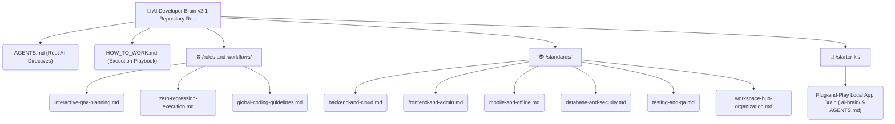
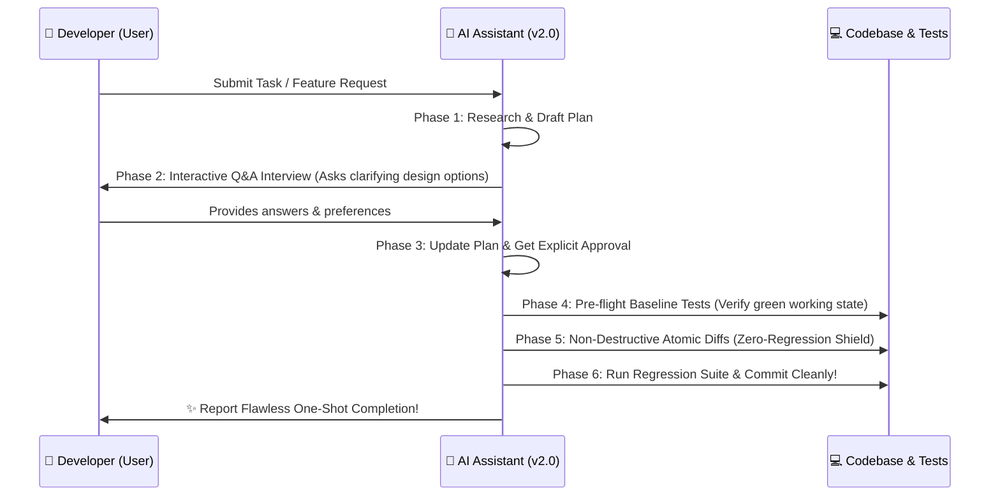

# 🧠 AI Developer Brain v2.1

> **The Smart, Concise, Self-Updating & Tool-Agnostic AI Engineering Hub and "Individual Project Brain" Starter Ecosystem for High-Scale Production Software.**

[](https://github.com/)
[](https://opensource.org/licenses/MIT)
[](#-the-v20-concise-3-root-architecture)
[](#-smart-agent-engine-interactive-qa--zero-regression-shield)

---

## 🎯 What is v2.1 (Smart, Concise & Self-Updating Agentic Core)?

Modern software engineering involves tight collaboration between developers and autonomous AI assistants (Cursor, Windsurf, Claude, Gemini). However, fragmented repositories with overly complex folder trees slow down context windows and induce hallucination or code regressions.

**AI Developer Brain v2.1** completely revolutionizes developer AI integration by introducing four major breakthroughs:
1. 📂 **Streamlined 3-Root Architecture (Less Folders, Easy Access)**: Consolidated 15+ sprawling subfolders into just 3 smart, intuitive command centers.
2. 🗣️ **Interactive Q&A Planning Loop & Fast-Track Override**: Eliminates blind AI coding while preventing Q&A fatigue! Agents conduct structured interviews for complex choices, but autonomously fast-track execution when specs are complete.
3. 🛡️ **One-Shot Zero-Regression Shield & Greenfield Exemption**: Hardened rules ensuring that existing functionality never breaks during feature additions, with intelligent exemptions for initial project scaffolding!
4. 🔄 **Self-Updating Application Memory Loop**: Autonomous agents dynamically update local domain vocabulary and architecture decision logs (`.ai-brain/`) after every session so your localized project intelligence never stagnates!

---

## ⚙️ The v2.1 Concise 3-Root Architecture

Instead of navigating dozen of fragmented directories, v2.1 provides instant access through 3 master pillars:



### 1️⃣ `⚙️ /rules-and-workflows/` (Action & Governance Engine)
Contains universal operational state machines and coding guardrails:
* **[interactive-qna-planning.md](./rules-and-workflows/interactive-qna-planning.md)**: The "Grill-Me" protocol teaching agents how to conduct interactive Q&A interviews before generating code.
* **[zero-regression-execution.md](./rules-and-workflows/zero-regression-execution.md)**: Pre-flight baseline test rules, atomic diff boundaries, and automated regression protection.
* **[global-coding-guidelines.md](./rules-and-workflows/global-coding-guidelines.md)**: Universal clean architecture, SOLID principles, guard clauses, and variable naming conventions.

### 2️⃣ `📚 /standards/` (Consolidated Domain Cortex)
High-density, token-efficient engineering handbooks featuring mandatory **✅ Good (Production Standard) vs. ❌ Bad (Anti-Pattern)** real-world code snippets:
* ⚙️ **[backend-and-cloud.md](./standards/backend-and-cloud.md)**: Node.js, NestJS, Python APIs, layered separation, JWT token rotation, Redis task queues, Docker, and K8s.
* 🛡️ **[frontend-and-admin.md](./standards/frontend-and-admin.md)**: React, Next.js, Tailwind tokens, state management (Zustand/TanStack Query), dual-layer RBAC, server-side paginated Data Grids, and immutable audit logs.
* 📱 **[mobile-and-offline.md](./standards/mobile-and-offline.md)**: Flutter, React Native, offline-first SQLite/Realm local sync engines, zero-cleartext token hardware vaults, and 120 FPS worker threads.
* 🔒 **[database-and-security.md](./standards/database-and-security.md)**: PostgreSQL 3NF normalization, indexing, active OWASP Top 10 immunizations, Argon2id hashing, and DDoS rate limiters.
* 🧪 **[testing-and-qa.md](./standards/testing-and-qa.md)**: 70/20/10 Testing Pyramid balance, Test-Driven Development (TDD) bug hunting, and e2e Cypress/Playwright patterns.
* 🏛️ **[workspace-hub-organization.md](./standards/workspace-hub-organization.md)**: Numbered folder setup guide (`00-ai-brain`, `01-active-projects`) for structuring all your local machine repositories!

### 3️⃣ `🚀 /starter-kit/` (Ready-to-Use Individual Project Brain)
A plug-and-play starter template designed for immediate copy-pasting into any target client codebase (new or legacy) to instantly establish its localized AI memory cortex (`.ai-brain/` and `AGENTS.md`).

---

## 🗣️ Smart Agent Engine: Interactive Q&A & Zero-Regression Shield

In v2.0, autonomous agents operating on your codebase follow an intelligent, non-destructive lifecycle:



---

## 🚀 How to Use: Step-by-Step Developer Playbooks

> [!IMPORTANT]  
> For the complete, definitive operational handbook detailing how developers and AI assistants collaborate across Interactive Q&A, Fast-Track Express mode, Greenfield setups, and the Self-Updating Memory Core, read our step-by-step master guide: **[🚀 HOW_TO_WORK.md (Master Execution Playbook)](./HOW_TO_WORK.md)**!

### 📖 Playbook A: Deploying an "Individual Brain" into a New or Legacy Project (60 Seconds!)
Just as every human has 1 individual brain combining education with personal memories, every software project requires its own localized memory cortex. To endow any app with autonomous intelligence:

```bash
# 1. Navigate to your target application repository root:
cd /path/to/my-saas-admin/

# 2. Copy the v2.0 Ready-to-Use starter kit directly into your app root:
cp -r /path/to/AI-Developer-Brain/starter-kit/.ai-brain .
cp /path/to/AI-Developer-Brain/starter-kit/AGENTS.md .

# 3. Open AGENTS.md and .ai-brain/project-identity.md and customize bracketed placeholders ({{PROJECT_NAME}}, {{TECH_STACK}}).
# 4. Open your app inside Cursor / Windsurf / Claude / Gemini — your project now has intelligent localized memory!
```

---

### 📖 Playbook B: Organizing All Your Code Repositories on Hard Drive / Server
To keep dozens of active, legacy, and R&D codebases cleanly sorted for AI assistant discovery, adopt our **Numbered Categorical Workspace Hub Architecture** documented in **[standards/workspace-hub-organization.md](./standards/workspace-hub-organization.md)**:

```text
D:\Dev-Workspace\                       <-- Master Codebase Hub Root on your drive
│
├── 🧠 00-ai-brain\                     <-- Central Intelligence (Place THIS repository here!)
│   └── AI-Developer-Brain/             
│
├── 🚀 01-active-projects\              <-- Live daily production repositories
│   ├── admin-dashboards\               <-- React / Next.js backoffice CRM portals
│   ├── backend-services\               <-- Node / NestJS / Python API microservices
│   └── mobile-apps\                    <-- Flutter / React Native mobile applications
│
├── 🛠️ 02-experiments-and-poc\           <-- Prototype testing & AI algorithm R&D trials
│   └── ai-agent-benchmarks\
│
└── 📦 03-legacy-and-archive\           <-- Past completed client apps & maintenance code
    └── 2023-legacy-billing-app\
```
* **Why it's a superpower**: Numerical prefixing (`00`, `01`, `02`) forces IDE file explorers and command palettes to sort repositories in logical architectural timeline priority!

---

## 🛠️ Universal AI Tool Compatibility Matrix

| AI Platform / Editor | Recommended Integration Method | v2.0 Smart Agent Capabilities |
| :--- | :--- | :--- |
| **Antigravity / Gemini** | Direct workspace root reading (`AGENTS.md`) | Interactive Q&A interview loops, one-shot zero-regression execution, and automated subagent orchestration. |
| **Cursor AI** | Symlink/copy `AGENTS.md` to root `.cursorrules` | Zero-hallucination code autocompletion, TDD unit test generators, and safe refactoring loops. |
| **Windsurf (Codeium)** | Reference `AGENTS.md` in root `.windsurfrules` | Cascade workspace multi-file editing precision without breaking adjacent module features. |
| **Claude Code (CLI)** | Point to global rules & local `.ai-brain/` | Deep structural architectural analysis, prompt reasoning, and high-density documentation generation. |
| **GitHub Copilot** | Place guidelines in `.github/copilot-instructions.md` | Consistent production completion matching local naming idioms and domain vocabulary. |

---

## 🤝 Contributing & Standards
* **Token Density Mandate**: Eliminate filler words. Rules must remain clear and directly executable by LLMs.
* **Code Proof Requirement**: Any architectural pattern added to `/standards/` must include explicit comparative **✅ Good (Production Standard) vs. ❌ Bad (Anti-Pattern)** TypeScript / Python / Bash snippets.

---

## 📜 License & Support

This repository is open-sourced under the **MIT License**.
* ⭐ **Star this repository** to bookmark your v2.0 Smart AI Engineering Core!
* 🍴 **Fork it** to establish customized organization-specific AI developer brains!
* 📢 **Share it** with your community to lead zero-hallucination, high-scale software engineering!
