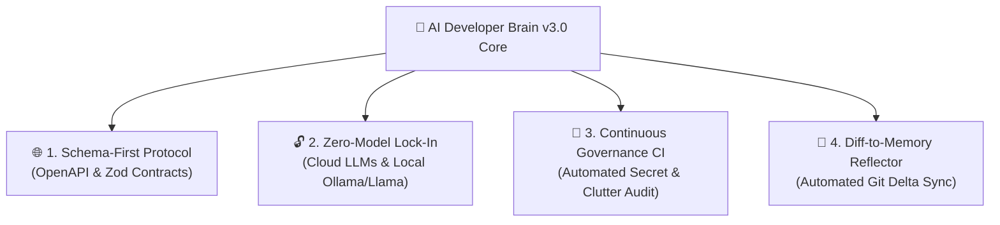

# 🧠 AI Developer Brain v3.0 (World-Class Universal Core)

> **The Smart, Token-Minimal, Self-Updating, Secure & Universal Any-Stack AI Engineering Command Center for High-Scale Production Software.**

[](https://github.com/)
[](./.brain/AI_ROUTING_INDEX.md)
[](./.brain/rules/immutable-ai-security-restrictions.md)
[](./projects/README.md)
[](#-universal-plug-and-play-ai-ide-adaptors)
[](https://opensource.org/licenses/MIT)

---

## 🌟 What is AI Developer Brain v3.0?

Modern software engineering thrives on collaboration between engineers and autonomous AI coding assistants (*Cursor, Windsurf, Claude, Gemini, Cline, Roo Code, Aider, GitHub Copilot*). However, typical AI configuration repositories suffer from critical real-world flaws: they dump massive prompt files that waste tens of thousands of tokens per chat, trigger context hallucination, expose sensitive database scripts and credential `.env` files to AI mutation, force hardcoded technology stacks, and clutter your root workspace.

**AI Developer Brain v3.0** completely revolutionizes autonomous AI software engineering through five groundbreaking pillars:
1. 🏛️ **Ultra-Clean Root Architecture**: At the repository root, there are strictly **ONLY TWO DIRECTORIES** (**`.brain/`** and **`projects/`**) and this single **`README.md`**! All AI intelligence, guardrails, playbooks, and scripts live cleanly inside `.brain/` while application code is isolated in `projects/`.
2. ⚡ **Token-Minimal On-Demand Routing (Saves up to 70% Tokens!)**: Through **[AI_ROUTING_INDEX.md](./.brain/AI_ROUTING_INDEX.md)**, AI assistants read *only* the specific domain memory buffer or standard required for the immediate task, eliminating prompt bloat and speeding up response latency.
3. 🛡️ **Zero-Trust Cybersecurity & AI Deny-List Shield**: Strict immutable security rules forbid AI agents from running direct terminal SQL DB mutations (`DROP/TRUNCATE`) or opening/modifying real credential files (`.env`, `*.pem`, `secrets.yml`).
4. 🌐 **Universal Any-Stack Technology Ready**: Whether you code in Node.js, Python, Go, Rust, Java, React, Vue, Flutter, or Swift, our AI brain adapts comfortably to ANY programming language placed inside `projects/`!
5. 🤖 **Self-Healing TDD Bug Hunting & Automated Continuous Governance**: Empowers AI agents to autonomously debug regressions while Git CI workflows physically reject commits that violate type checking, secret leaks, or memory link health!

---

## 🏗️ The 4 Eternal Compatibility Pillars (Future-Proof Architecture)

To ensure this workspace remains resilient over a 5-10 year corporate lifecycle without vendor lock-in or rule ignorance, v3.0 integrates four eternal compatibility solutions:



1. **🌐 Schema-First Interface Agreement**: Syntax changes over the years, but formal data contracts endure. Cross-stack boundaries between `projects/backend` and `projects/frontend` are governed by standard declarative schemas ([OpenAPI 3.1 & Zod](./.brain/rules/schema-first-interface-agreement.md)) rather than ad-hoc UI fetch typings.
2. **🔓 Zero-Model Vendor Lock-In & Open-Source Portability**: All project intelligence resides in open UTF-8 text files inside `.brain/`. Our scripts generate adaptors for both flagship cloud IDEs (*Cursor, Windsurf*) and **100% offline local Open-Source CLI swarms (*Ollama, Llama 3/4, DeepSeek, Aider, Roo Code*)** without API token costs!
3. **🤖 Continuous Automated Governance ("Living Guardrails")**: Converts passive guidelines into runtime CI verification shields. Our GitHub Action workflow ([brain-continuous-governance.yml](./.github/workflows/brain-continuous-governance.yml)) automatically audits code merges for secret leaks and structural cleanliness.
4. **🔄 Automated Diff-to-Memory Reflector Engine**: To eliminate reliance on conversational prompt loops, our built-in reflector script ([diff-to-memory-reflector.ps1](./.brain/scripts/diff-to-memory-reflector.ps1)) analyzes Git commit deltas across `projects/*` and generates automated memory synchronizations!

---

## 🏛️ The Pristine Root Directory Layout

To keep your workspace completely zero-clutter, our root hierarchy is organized into exactly two command chambers:

```text
AI-Developer-Brain/                    <-- Master Repository Root (Zero Root Clutter!)
│
├── 🧠 .brain\                         <-- Core AI Intelligence & Directives Center
│   ├── AGENTS.md                      <-- v3.0 Master Universal AI Directives & Ground Truth Law
│   ├── HOW_TO_WORK.md                 <-- v3.0 Step-by-Step Developer Operational Playbook
│   ├── AI_ROUTING_INDEX.md            <-- Token-Minimal On-Demand Router
│   ├── .cursorrules                   <-- Cursor AI IDE Adaptor Source
│   ├── .windsurfrules                 <-- Windsurf Cascade Flow Adaptor Source
│   ├── .clinerules                    <-- Cline / Roo Code Adaptor Source
│   ├── .aider.conf.yml                <-- Offline Open-Source Local Model (Ollama/Aider) Adaptor
│   ├── github-copilot-instructions.md <-- GitHub Copilot Workspace Instructions Source
│   ├── scripts\                       <-- Automated IDE Symlink, Governance CI & Reflector Scripts
│   ├── memory\                        <-- Auto-Updating AI Memory Buffers (Saves 70% Tokens!)
│   ├── rules\                         <-- Security Deny-List, Schema Protocols & TDD Guardrails
│   ├── standards\                     <-- Universal Any-Stack Code Handbooks & Schema Contracts
│   └── scratch\                       <-- Ephemeral AI Debug Scratchpad
│
├── 🚀 projects\                       <-- Dedicated Application Code Workspaces (Any Stack!)
│   ├── backend\                       <-- APIs, Cloud Microservices & DB Schemas
│   ├── frontend\                      <-- Web Applications & Interactive SaaS Portals
│   ├── admin\                         <-- Backoffice CRM & RBAC Dashboards
│   └── mobile\                        <-- Flutter, React Native, iOS & Android Apps
│
└── 📜 README.md                       <-- Master Repository Overview (This File!)
```

---

## 🛠️ Universal Plug-and-Play AI IDE Adaptors

In real-world software development, editors like Cursor or Windsurf require configuration dotfiles at the workspace root. To solve this without contaminating Git history or cluttering your root directory, our symlink system pairs directly with an **Enterprise Any-Stack `.gitignore`** (which also automatically blocks heavy folders like `node_modules/`, `venv/`, and `target/` from token trackers!):

### ⚡ Step 1: Execute 1-Click IDE Activator (Run Once per Developer Workspace)
```bash
# For Windows / PowerShell Developers:
powershell -ExecutionPolicy Bypass -File ".\.brain\scripts\setup-ide-adaptors.ps1"

# For Linux / macOS / UNIX Developers & CI Pipelines:
bash ./.brain/scripts/setup-ide-adaptors.sh
```

This utility seamlessly activates universal rule enforcement across all editors:

| AI Tooling & Editor | Adaptor Source in `.brain/` | Local Linked Target (Git Ignored) | Unlocks Behind the Scenes |
| :--- | :--- | :--- | :--- |
| **Antigravity / Gemini IDE**| **[`.brain/AGENTS.md`](./.brain/AGENTS.md)** | Direct native scanning | Autonomous state machine, interactive Q&A interview modals, and subagent orchestration. |
| **Cursor AI IDE** | **[`.brain/.cursorrules`](./.brain/.cursorrules)** | Root `.cursorrules` | Zero-hallucination code completion, token routing, and automated memory sync. |
| **Windsurf (Codeium Flow)**| **[`.brain/.windsurfrules`](./.brain/.windsurfrules)** | Root `.windsurfrules` | Cascade multi-file workspace refactoring protected by the Zero-Regression verification shield. |
| **Cline / Roo Code**| **[`.brain/.clinerules`](./.brain/.clinerules)** | Root `.clinerules` / `.roorules` | Autonomous CLI coding agent guardrails enforcing scratchpad usage and TDD healing loops. |
| **Aider & Local Open-Source**| **[`.brain/.aider.conf.yml`](./.brain/.aider.conf.yml)**| Root `.aider.conf.yml` | 100% offline local LLM execution (*Ollama, Llama 3/4, DeepSeek*) reading pure markdown rules! |
| **GitHub Copilot Chat** | **[`.brain/github-copilot-instructions.md`](./.brain/github-copilot-instructions.md)**| `.github/copilot-instructions.md`| Consistent symbol completion matching established domain vocabulary across any programming language. |

---

## 🛡️ Automated Governance & Reflector Commands

Verify repository compliance or synchronize commit intelligence at any time:
```bash
# Execute Automated Continuous Governance Audit (Verifies secret immunity & link health):
powershell -ExecutionPolicy Bypass -File ".\.brain\scripts\validate-brain-governance.ps1"

# Execute Automated Diff-to-Memory Reflector (Synchronizes Git commit deltas into AI memory):
powershell -ExecutionPolicy Bypass -File ".\.brain\scripts\diff-to-memory-reflector.ps1"
```

---

## 🚀 Quick Start Guide (How to Work)

> [!IMPORTANT]  
> For definitive step-by-step developer instructions, automated test runners, and copy-paste AI prompt contracts, read our master playbook: **[🚀 .brain/HOW_TO_WORK.md (Master Operational Playbook)](./.brain/HOW_TO_WORK.md)**!

### Step 2: Initialize Your Application Code into `projects/`
Navigate into `projects/` and begin writing or cloning your software applications:
```bash
# Example A: Scaffolding a modern Next.js TypeScript Web Application inside projects/frontend:
cd projects/frontend
npx -y create-next-app@latest ./ --typescript --tailwind --eslint --app --no-interactive

# Example B: Cloning an existing Python FastAPI Microservice into projects/backend:
cd projects/backend
git clone https://github.com/your-org/backend-api.git .
```

---

## 🤝 Contributing & License

This master architectural framework is open-sourced under the **MIT License**.
* ⭐ **Star this repository** to supercharge your AI engineering workflows!
* 🍴 **Fork it** to empower engineering teams with token-efficient, zero-regression software mastery!
* 📢 **Share it** with the global developer community!
