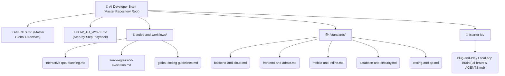

# 🧠 AI Developer Brain

> **The ultimate open-source AI engineering knowledge hub, execution engine, and customizable "Project Brain" starter ecosystem for building scalable, high-scale production software with autonomous AI assistants.**

[](https://github.com/darshanghoghari/AI-Developer-Brain)
[](https://opensource.org/licenses/MIT)
[](#-supported-ai-coding-tools)
[](#-contributing--community)

---

## 🌟 Why This Repository Exists

Most software repositories focus solely on **code**.  
This repository focuses on the **architectural intelligence and execution logic behind the code**.

When pairing with autonomous AI coding tools (*Cursor, Windsurf, Claude Code, Gemini IDE, GitHub Copilot*), developers often face repetitive prompting, Context Window exhaustion, dependency hallucinations, and destructive code regressions where an AI breaks existing working features while adding new ones.

**AI Developer Brain** solves this by acting as a universal **Autonomous Engineering State Machine**. By embedding our localized memory cortex (`.ai-brain/`) into your application repository, your AI assistant learns your domain rules, respects your architectural boundaries, conducts interactive Q&A interviews for complex decisions, and executes feature diffs with zero regression!

---

## 🏷️ Version History & Architectural Evolution

As AI capabilities evolve from basic chat autocomplete to autonomous multi-file agentic execution, our knowledge architecture evolves alongside them. Navigate through our official production branches and version releases:

| Version & Git Branch | Status & Lifecycle | Architecture & Philosophy | Key Capabilities & Ideal Use Case | Branch Navigation |
| :--- | :---: | :--- | :--- | :--- |
| **`v1.0`** <br> *(branch: `brain-v1`)* | 📚 **Stable Ref** <br> *(Encyclopedia)* | **Foundational Knowledge Hub** <br> Comprehensive domain library structured across 15+ specialized categorical subfolders. | Exhaustive reference collection covering Backend, Frontend, Mobile, Database, Cloud, DevOps, testing strategies, and QA checklists. Ideal for human study and deep offline learning. | ➡️ [Navigate to `brain-v1`](https://github.com/darshanghoghari/AI-Developer-Brain/tree/brain-v1) |
| **`v2.0` / `v2.1`** <br> *(branch: `main` / `brain-v2`)* | 🚀 **Active Core** <br> *(Autonomous)* | **Smart Agentic Core (3-Root Hub)** <br> Re-architected for ultra-low token latency and autonomous agent execution without context clutter. | • **Interactive Q&A Planning ("Grill-Me" Loop) & Fast-Track Overrides** <br> • **One-Shot Zero-Regression Shield & Greenfield Exemptions** <br> • **Self-Updating Memory Cortex (`.ai-brain/`)** that learns over time! <br> • **Master Execution Playbook & Command Vault** | ➡️ [View Active Core](./HOW_TO_WORK.md) |

### 💻 Switching Branches via Git CLI
To evaluate different architectural versions locally on your machine, run these simple terminal commands:
```bash
# Clone the complete repository:
git clone https://github.com/darshanghoghari/AI-Developer-Brain.git

# Switch to Version 1.0 (Foundational Knowledge Encyclopedia):
git checkout brain-v1

# Switch to Version 2.1 (Active Smart Agentic & Self-Updating Core):
git checkout main
# or
git checkout brain-v2
```

---

## ⚙️ The v2.1 Concise 3-Root Architecture

To prevent context overload and enable instantaneous discovery for LLMs, **Version 2.1** organizes all engineering wisdom into just three master pillars governed by a root AI command directive:



### 🏆 Key v2.1 Breakthrough Features
1. 🗣️ **Interactive Q&A vs Fast-Track Execution**: Before building complex features, the AI pauses and presents multiple-choice design trade-offs. However, when you provide exhaustive specs or command `"build fast"`, the AI activates the **Fast-Track Override** to adopt production standards instantaneously without Q&A pauses!
2. 🛡️ **One-Shot Zero-Regression Shield**: Enforces strict Pre-Flight unit verification, non-destructive **Atomic Diffing** (never blindly overwriting entire files!), and automated Post-Edit verification. Includes intelligent **Greenfield Exemptions** for new repository scaffolding!
3. 🔄 **Self-Updating Memory Loop**: Whenever an AI finishes building a domain feature or installing an approved tool, it autonomously records new terms and Architecture Decision Records (ADRs) directly into your local `.ai-brain/` directory so project intelligence never stagnates!

---

## 🚀 Quick Start: Deploy Your Local Project Brain in 60 Seconds

You can instantly inject an autonomous memory cortex into **any** startup or legacy application repository using our plug-and-play starter kit:

```bash
# 1. Navigate to your existing software target application folder:
cd /path/to/my-saas-platform/

# 2. Copy the v2.1 Starter Kit directly into your root directory:
cp -r /path/to/AI-Developer-Brain/starter-kit/.ai-brain .
cp /path/to/AI-Developer-Brain/starter-kit/AGENTS.md .

# 3. Customize bracketed placeholders in .ai-brain/project-identity.md (e.g., {{TECH_STACK}}).
# 4. Open your project inside Cursor, Windsurf, Claude, or Gemini — your app now has intelligent memory!
```

> [!IMPORTANT]  
> **Want step-by-step guidance?** For our complete operational manual featuring ready-to-paste AI Prompting Payloads, Greenfield CLI scaffolding scripts, and JSON error contracts, read our definitive developer handbook:  
> **👉 [🚀 HOW_TO_WORK.md (Master Step-by-Step Execution Playbook)](./HOW_TO_WORK.md)**

---

## 🛠️ Supported AI Coding Tools

| AI Coding IDE / Platform | Configuration Method | Core Benefits |
| :--- | :--- | :--- |
| **Antigravity / Gemini IDE** | Native discovery; simply open workspace folder. | Autonomous multi-step planning, subagent task execution, and interactive modals. |
| **Cursor AI** | Symlink or copy root `AGENTS.md` to `.cursorrules`. | Precision context auto-completion, atomic multi-file edits, and TDD verification. |
| **Windsurf (Codeium)** | Reference master guidelines inside `.windsurfrules`. | Seamless cascade refactoring without breaking adjacent module interfaces. |
| **Claude Code (CLI)** | Run from root folder; natively reads `AGENTS.md`. | Deep architectural synthesis, structural refactoring, and ADR generation. |
| **GitHub Copilot / Aider** | Copy rules to `.github/copilot-instructions.md`. | Ubiquitous domain naming consistency and strict static type compliance. |

---

## 🐞 Found a Problem or Bug? Let Us Know!

> [!NOTE]  
> **We strive for bulletproof engineering perfection!** If you detect ANY problems, bugs, architectural edge cases, unclear formatting, or AI hallucination loops while utilizing this repository, **we want to fix it immediately!**

Please don't hesitate to report any problems directly to the repository maintainer:
* **📧 Direct Developer Email**: **[darshanghoghari5657@gmail.com](mailto:darshanghoghari5657@gmail.com)** *(Please subject your email: `[AI Brain Issue] - <Short Summary>`)*
* **🐛 GitHub Issues**: [Open a Bug Report or Feature Request](https://github.com/darshanghoghari/AI-Developer-Brain/issues) directly on GitHub!

Every problem detected helps us harden our rules, upgrade our standards, and improve autonomous engineering for developers around the globe!

---

## 🤝 Contributing & Community

We believe the future of software engineering is human architectural mastery combined with autonomous AI speed. Contributions from engineers, architects, and AI enthusiasts are deeply appreciated!

1. **Fork** the repository and create your custom feature branch (`git checkout -b feature/amazing-ai-rule`).
2. **Adhere** to our **Zero-Regression Shield** and clean formatting norms.
3. **Commit** your enhancements using conventional commits (`feat: add Rust concurrency standard`).
4. **Push** to your branch and submit a **Pull Request**!

### ⭐ Support the Mission
If this project saves you time, prevents AI bugs, or helps you ship production code faster:
* **⭐ Star this repository on GitHub**
* **🍴 Fork it for your personal engineering vault**
* **📢 Share it on X (Twitter), LinkedIn, and developers' communities!**

---

## 📜 License
This project is open-source and released under the **[MIT License](https://opensource.org/licenses/MIT)**. You are free to use, modify, and integrate this knowledge base into commercial, personal, or enterprise applications.

*Crafted with precision by **Darshan Ghoghari** & community contributors.*
