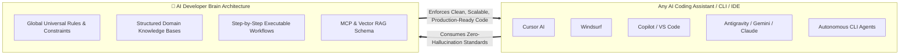

# 🧠 AI Developer Brain: Comprehensive Development Plan

> **A Universal, Tool-Agnostic Software Engineering Knowledge Base Designed for Human Excellence and AI Coding Autonomy.**

---

## 🎯 Executive Summary & Vision

Modern software engineering involves tight collaboration between human developers and AI coding assistants. However, traditional documentation and codebase guides fail when paired with LLM assistants because they are verbose, unstructured, and tied to specific developer IDEs or outdated paradigms.

The **AI Developer Brain** is designed to solve this by providing a **Universal, Tool-Agnostic, High-Density Engineering Core**. Whether using **Gemini, Claude, GPT-4, Cursor, Windsurf, GitHub Copilot, Cline, Aider, or custom multi-agent frameworks**, the AI Developer Brain structures engineering standards so any AI assistant produces clean, reliable, modular, and production-ready code consistently.

---

## 🌍 Global, Tool-Agnostic AI Philosophy

A key design requirement of the Brain is **Universal Applicability**. Because workflows adapt and AI tools change constantly, our rules and guidelines are never locked into one platform.



### Core Tenets of Universal AI Integration:
1. **Deterministic Quality over Guesswork**: Rules are framed as concrete architectural constraints ("ALWAYS use custom exception filters in REST APIs", "NEVER store JWTs in local storage") rather than abstract theories.
2. **Tool-Agnostic Rules Layer (`AGENTS.md`)**: A centralized, standardized specification that can be read natively by modern AI code assistants or automatically linked to specific tool config files (e.g., `.cursorrules`, `.windsurfrules`, `.github/copilot-instructions.md`).
3. **High Token Efficiency**: Concise markdown tables, comparative code snippets (**Good vs. Bad**), and bullet points maximize comprehension within LLM context windows while minimizing token consumption.

---

## 🏗️ The 4-Layer High-Density Architecture

The repository is organized into four complementary layers, designed for modular expansion and immediate retrieval:

### 1️⃣ Layer 1: Universal Rules & Directives (`/rules/` & `AGENTS.md`)
Establishes baseline behavior, clean code formatting, architectural immutables, and communication protocols for AI agents.
* **`AGENTS.md`**: Master global rules file defining code cleanliness, DRY principles, typing standards, and structured error handling for ALL coding tasks.
* **`/rules/global-coding-guidelines.md`**: Deep-dive constraints across programming languages and design patterns (SOLID, DRY, KISS).

### 2️⃣ Layer 2: Comprehensive Engineering Standards (`/docs/`)
The foundational engineering "Cortex" covering every domain of enterprise software development:
* 🏗️ **`architecture/`**: Clean Architecture, Domain-Driven Design (DDD), Event-Driven Systems, Multi-tenant SaaS patterns, Microservices vs. Modular Monoliths.
* ⚙️ **`backend/`**: Node.js/TypeScript, NestJS, Python APIs, REST vs. GraphQL, WebSockets, Asynchronous Processing & Task Queues (Redis/RabbitMQ), API Versioning, Structured Error Handling.
* 🌐 **`frontend/`**: React, Next.js, Angular, Vue, Tailwind CSS design systems, State Management (Zustand, Redux, Context), SSR/Static caching, Form Validation & Accessibility (a11y).
* 📱 **`mobile/`**: **Cross-Platform & Native Mobile Architecture**
  * Frameworks: Flutter, React Native, .NET MAUI, iOS (SwiftUI), Android (Kotlin).
  * Patterns: Offline-first architecture, SQLite/Realm local sync, Biometric authentication, Background services, Push notifications, Battery & memory optimization, App Store / Play Store release readiness.
* 🛡️ **`admin/`**: **Enterprise Admin Dashboards & Backoffice Systems**
  * Patterns: Role-Based & Attribute-Based Access Control (RBAC/ABAC), Data tables & filtering pipelines (Pagination, sorting, Excel/PDF exports), Dynamic chart analytics (Recharts, Chart.js), Audit log trail architecture, CMS & workflow publishing pipelines.
* 🗄️ **`database/`**: PostgreSQL, MongoDB, Redis, DocumentDB, MySQL. Normalization vs. denormalization, migration management (Prisma, TypeORM, Alembic), query optimization, and indexing strategies.
* ☁️ **`devops/`**: Docker multi-stage containerization, Kubernetes helm charts, CI/CD GitHub Actions pipelines, Nginx configurations, Zero-downtime deployments, PM2 clustering.
* 🔒 **`security/`**: OWASP Top 10 mitigation, API Security, OAuth2 / OIDC flows, Data encryption (at-rest & in-transit), Rate limiting & DDoS protection.
* ⚡ **`performance/` & 🧪 `testing/`**: Frontend bundle optimization, Database query auditing, Test-Driven Development (TDD), Unit testing (Jest, Vitest), End-to-End Testing (Playwright, Cypress), Load testing (k6).

### 3️⃣ Layer 3: Actionable Workflows & Prompts (`/workflows/` & `/prompts/`)
Structured task-driven protocols designed to guide AI agents step-by-step through complex software lifecycle actions:
* **`/workflows/feature-implementation-workflow.md`**: Requirements decomposition -> Schema update -> Test creation (TDD) -> Code implementation -> Verification.
* **`/workflows/code-review-checklist.md`**: Automated quality audit criteria for AI PR reviews (Performance lags, security loopholes, naming conventions).
* **`/workflows/debugging-tdd-loop.md`**: Root-cause detection -> Write reproducing failing test -> Implement minimal patch -> Regression test.
* **`/prompts/`**: Reusable zero-shot and chain-of-thought prompt templates for system design, database modeling, refactoring, and code explanation.

### 4️⃣ Layer 4: MCP & Vector RAG Schema (`/templates/` & Frontmatter Standards)
Ensures dynamic programability. Every technical specification in the repository requires a standardized YAML Frontmatter block:
```yaml
---
title: "Offline-First Mobile Synchronization Standard"
category: "mobile"
domain: "react-native, flutter"
tags: ["offline", "sqlite", "sync", "background-fetch"]
version: "1.0.0"
author: "AI Developer Brain"
---
```
This enables **Model Context Protocol (MCP) servers** and **Vector Database RAG pipelines** to dynamically query and load only the specific engineering rules relevant to an active coding session, ensuring crisp responses without prompt bloating.

---

## 📂 Master Repository Tree Skeleton

```text
AI-Developer-Brain/
├── AGENTS.md                          # Master Universal AI Directives
├── plan.md                            # Architecture & Master Implementation Plan
├── README.md                          # Repository overview & navigation
│
├── docs/                              # Engineering Knowledge Core
│   ├── architecture/                  # Clean architecture & system design blueprints
│   ├── backend/                       # Backend API standards & messaging patterns
│   ├── frontend/                      # Web & styling standards (React, Next, Tailwind)
│   ├── mobile/                        # Flutter, React Native, MAUI, Offline-first guides
│   ├── admin/                         # Admin portals, RBAC, analytics tables & audit logs
│   ├── database/                      # Relational & NoSQL modeling and indexing
│   ├── devops/                        # Docker, CI/CD, K8s, Cloud pipelines
│   ├── security/                      # OWASP, auth flows & encryption best practices
│   ├── performance/                   # Profiling, latency reduction, memory optimization
│   └── testing/                       # TDD, unit tests, integration & E2E pipelines
│
├── rules/                             # Tool-Agnostic & Specific Agent Rules
│   ├── global-coding-guidelines.md    # Universal programming standards & code quality
│   ├── cursor.rules.example           # Reference mappings for Cursor IDE
│   ├── windsurf.rules.example         # Reference mappings for Windsurf
│   └── copilot.instructions.example   # Reference mappings for GitHub Copilot
│
├── templates/                         # Reusable Blueprint Scaffolding
│   ├── doc-template.md                # Standard knowledge doc template with YAML frontmatter
│   ├── workflow-template.md           # AI step-by-step workflow template
│   └── architecture-adr-template.md     # Architectural Decision Record (ADR) template
│
├── workflows/                         # Step-by-Step AI Execution Protocols
│   ├── feature-implementation.md      # Feature building lifecycle protocol
│   ├── code-review-audit.md           # AI review criteria for PRs & diffs
│   └── debugging-root-cause.md        # TDD regression & fix workflow
│
├── prompts/                           # High-efficiency Prompt Library
│   ├── system-design-prompts.md
│   ├── security-auditor-prompts.md
│   └── refactor-optimizer-prompts.md
│
└── examples/                          # Reference production implementation patterns
```

---

## 🗺️ Phased Implementation Roadmap

### Phase 1: Repository Foundation & Core Architecture (Current Phase)
- [x] Create comprehensive Master Plan (`plan.md`).
- [ ] Implement Master Universal AI Rules (`AGENTS.md`).
- [ ] Initialize physical folder structures across all domains (`docs/`, `rules/`, `templates/`, `workflows/`, `prompts/`).
- [ ] Establish standardized architectural templates (`doc-template.md`, `workflow-template.md`, `global-coding-guidelines.md`).

### Phase 2: High-Priority Engineering Standards
- [ ] **Backend Core**: REST API design standards, Node.js/TypeScript production configurations, NestJS architecture guide, Error & Logging handling protocols.
- [ ] **Frontend & Styling**: Next.js & React scalable structural layouts, state management blueprints, Tailwind CSS architectural tokens.
- [ ] **Admin & Dashboard Architecture**: Complete RBAC pattern implementation, Data Grid pagination/filtering patterns, Admin Audit Logging design.
- [ ] **Mobile Engineering**: Cross-platform Flutter/React Native project structures, Offline-First local database synchronization patterns, Secure keychain storage.
- [ ] **Security & Database**: PostgreSQL Indexing guidelines, OWASP vulnerability prevention checklists, JWT/Refresh token implementation standards.

### Phase 3: Actionable AI Workflows & Prompt Engineering
- [ ] Build end-to-end execution checklists in `/workflows/` for autonomous feature building and PR audits.
- [ ] Construct high-precision zero-shot and system prompts in `/prompts/` for architecture review, query optimization, and code review.

### Phase 4: MCP Integration & Dynamic Vector Indexing
- [ ] Develop an example Model Context Protocol (MCP) server integration script in Python/Node.js to demonstrate real-time retrieval of standards during development sessions.
- [ ] Create automated markdown linting and schema validation scripts in GitHub Actions to enforce structured YAML frontmatter on all new contributions.

---

## ✅ Quality Assurance & Verification Metrics

Every document added to the **AI Developer Brain** must abide by the following quality criteria:
1. **Token Density**: Zero filler words. Instructions must be concrete, unambiguous, and immediately actionable.
2. **Code Proof**: Every engineering guideline must accompany a clear **✅ Good (Production Quality)** vs. **❌ Bad (Anti-Pattern / Vulnerations)** code snippet example.
3. **Structured Frontmatter**: No document is merged without valid YAML frontmatter containing proper `category`, `domain`, and `tags` keys.
4. **Tool Invariance**: Guidelines must never depend exclusively on proprietary plugin syntaxes unless placed in a tool-specific folder; default principles must remain globally readable by any LLM.
