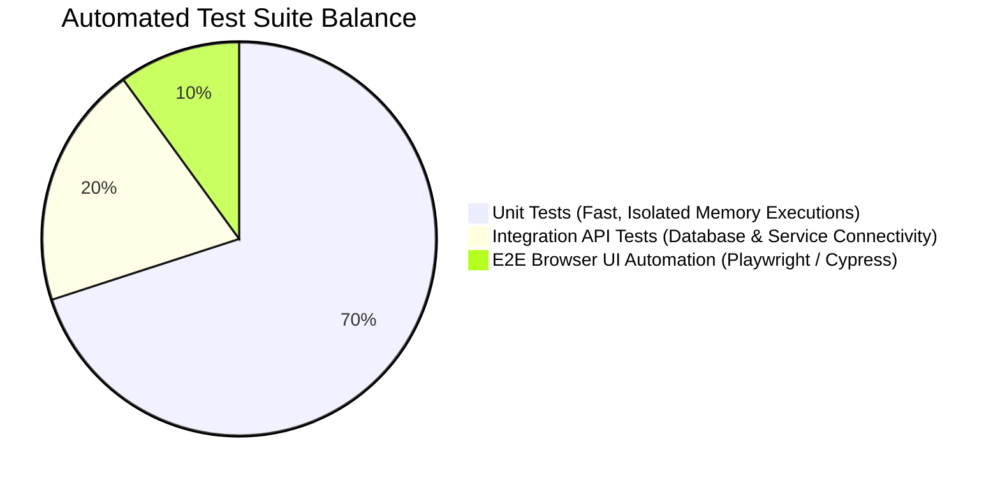

# 🧪 Testing Strategy & Quality Assurance Architecture

> **Consolidated standards governing Test-Driven Development (TDD), the 70/20/10 Testing Pyramid, continuous integration validation, and zero-regression quality gates.**

---

## 1. The 70/20/10 Testing Pyramid Balance

To achieve high test coverage without bloating CI runtime execution durations, structure test suites across an optimized pyramid ratio:



* **70% Unit Tests**: Execute sub-millisecond automated checks against isolated domain calculation formulas, utility helper parsers, and custom Redux/Zustand state selectors. Mock external network calls and relational database queries.
* **20% Integration Tests**: Verify communication between backend service layers, ephemeral containerized databases (*Docker test containers / SQLite in-memory*), and Redis queue producers.
* **10% End-to-End (E2E) Suites**: Execute real browser interactive simulations (*Playwright, Cypress*) across high-value enterprise user flows (*User Registration, Subscription Payment Checkout, Admin RBAC Login*).

---

## 2. Test-Driven Development (TDD) Bug Resolution Pipeline

When an autonomous AI agent or human developer is assigned a defect ticket or bug report, they MUST enforce a deterministic **TDD Red-Green-Refactor loop**:
1. **[RED]**: Write a tailored automated unit or integration test case replicating the specific bug scenario. Execute the suite to prove the newly written test **fails (RED)** against current broken codebase logic.
2. **[GREEN]**: Apply localized, drop-in code edits to resolve the bug logic until the newly added test compiles and **passes (GREEN)** cleanly!
3. **[REFACTOR]**: Clean up variable formatting while running the entire test suite to ensure **Zero Regressions** occur across adjacent application components.

```typescript
// ❌ Bad (Anti-Pattern: Modifying core business math blindly without automated regression test proof)
// Hacking src/services/invoice.service.ts directly without adding unit tests for edge cases!

// ✅ Good (Production Standard: TDD Unit test establishing proof of bug fix in financial math)
describe('InvoiceCalculationService - Bugfix #204', () => {
  it('correctly rounds tax percentages to zero decimal integer cents without binary overflow', () => {
    const service = new InvoiceCalculationService();
    const resultInCents = service.computeTotalWithTax(1050, 0.0825); // $10.50 + 8.25% tax
    expect(resultInCents).toBe(1137); // Must equal exactly $11.37 in integer cents!
  });
});
```
